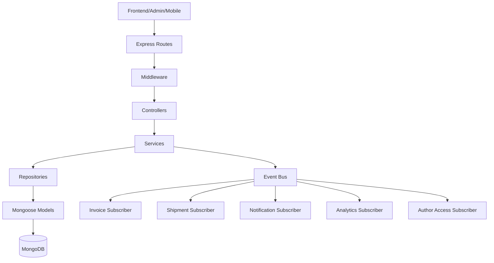
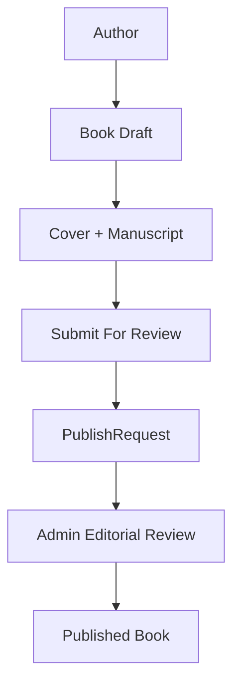

# HM Backend Complete Frontend/API Handover

**Generated:** 2026-08-09  
**Revision:** 1.1  
**Status:** AUTHORITATIVE FRONTEND INTEGRATION CONTRACT  
**Supersedes:** Initial handover revision  
**Security hotfix:** Public registration role escalation blocked on 2026-08-10  
**Repository:** `C:/Users/user/hm_backend`  
**Branch:** `main`  
**HEAD:** `6d437ad4cde316f1a00e7d5e2b911b45a359c053`  
**Canonical human-readable handover:** `docs/HM_BACKEND_COMPLETE_HANDOVER.md`

This document is the single canonical integration guide for frontend, admin-panel, QA, deployment, and future engineering work. It was prepared from actual runtime routing, `src/docs/apiInventory.js`, generated OpenAPI, Postman artifacts, existing docs, and certification notes. Runtime code was not changed for this document.

## Revision 1.1 Changes

Revision 1.1 removes the temporary payload pause after verifying every previously paused write contract against runtime code, route inventory, generated OpenAPI, and request schemas.

- Public registration role escalation is blocked: public register always creates `reader`.
- `Book.mrp` is documented as the canonical book price; legacy `price` is only a synchronized compatibility alias.
- Author book and admin book write contracts are separated.
- All 6 multipart upload APIs declare the correct `multipart/form-data` payload schemas.
- Author access plan, grant, revoke, and restore payloads are explicit.
- Author book submission, editorial actions, and royalty settlement payloads are complete.
- Critical frontend response contracts, state naming, F1-F21 implementation guidance, and screen-to-API matrix are authoritative.
- Documentation validation now proves route coverage, write contract coverage, multipart schema coverage, request schema integrity, public register role removal, and MRP canonical wording.

## Security Hotfix: Public Registration Contract

Public registration always creates a `reader` account. Frontend clients must not send a `role` field to `POST /api/auth/register`.

```json
{
  "name": "Reader Name",
  "email": "reader@example.com",
  "password": "StrongPass123!"
}
```

Author privileges are granted only after Admin approval of an AuthorApplication. Admin privilege is never available through public registration. If a legacy client sends `role`, the backend strips/ignores it at validation and the service layer still creates `reader`.

## Table Of Contents

1. Document Purpose
2. Backend Completion Status
3. High-Level Architecture
4. Backend Domain Overview
5. Environment + Base URL
6. Authentication Overview
7. Authentication Frontend Implementation
8. User Roles
9. User Context / Bootstrap Contract
10. Universal API Conventions
11. Standard Success Response
12. Standard Error Response
13. Error Handling Strategy for Frontend
14. Complete Error Code Reference
15. Pagination Contract
16. Search, Sort and Filters
17. Customer Frontend Architecture
18. Catalog APIs
19. Book Object
20. Book Listing Frontend Implementation
21. Book Detail Frontend Implementation
22. Cart Strategy
23. Checkout API
24. Fields Frontend Must Never Control
25. Checkout Calculation
26. Customer Payment Flow
27. Customer Payment APIs
28. Customer Payment State Machine
29. Payment Frontend UI Handling
30. UTR Submission
31. Orders
32. Order State Machine
33. Invoice Integration
34. Shipment + Tracking
35. Become an Author Flow
36. Author Application APIs
37. Author Application States
38. Permanent Author Permission Rule
39. Author Publishing Architecture
40. Author Book APIs
41. Author Book Create Payload
42. Author Book Field Permission Matrix
43. Author Upload APIs
44. Upload Frontend Example
45. Publishing Submit API
46. Publishing State Machine
47. Changes Requested Flow
48. Rejected Flow
49. Published Flow
50. Dashboard Access Overview
51. Dashboard Access State API
52. Dashboard Access State Machine
53. Dashboard Plan
54. Purchase Dashboard Access
55. Dashboard Payment Flow
56. Dashboard Server-Owned Fields
57. Dashboard Access Error Handling
58. Dashboard Summary API
59. Dashboard Metric Definitions
60. Royalty Terminology
61. Analytics API
62. Book Performance
63. Royalty History
64. Historical Royalty Integrity
65. ZERO vs UNKNOWN
66. Partial Data UX
67. Author Settlement APIs
68. Settlement Object
69. Settlement States
70. Author Settlement UX
71. Admin Panel Architecture
72. Admin Authentication + Authorization
73. Admin Dashboard API
74. Admin Dashboard UI Implementation
75. Admin Users
76. Admin Author Applications
77. Admin Authors
78. Admin Author Access Plans
79. Admin Author Access Purchases
80. Manual Grant/Revoke/Restore
81. Admin Payment Verification
82. Admin Payment Queue Object
83. Approve Payment
84. Reject Payment
85. Admin Publishing Queue
86. Request Changes
87. Reject Publishing Request
88. Approve Publishing Request
89. Admin Book Management
90. Admin Book Form Fields
91. Admin Orders
92. Admin Invoices
93. Admin Shipments
94. Settlement Accounting Overview
95. Settlement Eligibility
96. Settlement Preview
97. Create Settlement
98. Approve Settlement
99. Double-Settlement Protection
100. Cancel Settlement
101. Manual Payout
102. Mark Paid API
103. Server-Owned Payout Amount
104. Duplicate Mark-Paid
105. Master Endpoint Table
106. Complete READ Endpoint Reference
107. Complete WRITE Endpoint Reference
108. Complete Payload Catalog
109. Complete Response Catalog
110. TypeScript Contract Section
111. API Client Example
112. React / Next.js Examples
113. Frontend Development Order
114. Frontend Phase Details
115. Screen-to-API Matrix
116. State Management Recommendations
117. Loading / Empty / Error UX Matrix
118. Retry Guidance
119. Idempotency Guidance
120. Frontend Security Rules
121. Sensitive Fields
122. IDOR Expectations
123. Frontend Integration Test Checklist
124. Error Test Checklist
125. Role Test Matrix
126. Payment Test Matrix
127. Publishing Test Matrix
128. Royalty Test Matrix
129. Frontend Environment Checklist
130. Backend Deployment Assumptions
131. Manual Payout Operations
132. Troubleshooting
133. FAQ
134. Glossary
135. Final Handover Checklist

## 1. Document Purpose

HM Backend is a production Node.js, Express, MongoDB backend for a publishing and book-commerce platform. It supports public catalog browsing, reader accounts, checkout with manual UPI verification, author applications, author-owned publishing, paid author dashboard access, admin operations, invoices, shipments, notifications, analytics, and royalty settlement accounting.

This guide is for frontend developers, admin-panel developers, mobile developers, QA engineers, backend maintainers, DevOps engineers, and future coding agents. A developer should be able to integrate the platform by reading this file without opening backend source files.

## 2. Backend Completion Status

| Phase | Scope | Status | Frontend impact |
| --- | --- | --- | --- |
| Phase 1 | Book MRP / pricing | Complete | Use `book.mrp` as canonical display and checkout price. `price` remains compatibility. |
| Phase 2 | Multi-purpose payment | Complete | Payments can be `ORDER_PURCHASE` or `AUTHOR_ACCESS`. Do not assume every payment has an order. |
| Phase 3 | Author approval + paid dashboard | Complete | Author role gives publishing; paid entitlement unlocks dashboard only. |
| Phase 4 | Author publishing workflow | Complete | Authors can create drafts, upload assets, submit for review, and track state. |
| Phase 5 | Author dashboard / royalty analytics | Complete | Entitled authors can view metrics, royalties, and performance. |
| Phase 5.1 | Historical royalty integrity | Complete | Historical orders without snapshots show unknown royalty, not zero. |
| Phase 6A | Royalty settlement / manual payout | Complete | Admin creates settlements and records manual payout. |
| Phase 7 | Admin + frontend contracts | Complete | Admin/user/content compatibility endpoints exist. |
| Phase 8 | Production certification | Complete | Code certification passed; deployment remains conditional on DB migration/audit and secret review. |

Automatic payout provider: **not implemented by design**. Manual payout is the current production business design.

## 3. High-Level Architecture

```text
Frontend / Admin / Mobile
  -> Express routes
  -> middleware: auth, role, upload, validation, security
  -> controller: request orchestration only
  -> service: business rules and transactions
  -> repository: persistence and query shaping
  -> Mongoose models
  -> MongoDB
```



Events and subscribers decouple side effects. Payment verification can create invoices, shipments, notifications, analytics, and author access effects after successful state changes. Controllers must not call subscribers directly.

## 4. Backend Domain Overview

- Authentication: register, login, refresh, logout, password reset, current user.
- Users: current profile, user context, account orders, invoices, shipments, notifications, wishlist, library.
- Books: catalog, detail, related books, reviews, admin CRUD, author-owned drafts.
- Categories: public category browsing and admin category management.
- Reviews: customer review creation and admin moderation.
- Orders: checkout, payment verification bridge, cancellation, tracking.
- Payments: provider-agnostic payment attempts, manual UPI UTR, admin verification.
- Invoices: generated after verified order payment, downloadable.
- Shipping: shipment records and tracking after order payment/invoice flow.
- Uploads: Cloudinary-backed image and document upload with config checks.
- Author Applications: reader applies; admin approves/rejects; approval promotes user to author.
- Author Access: paid author dashboard entitlement using `AUTHOR_ACCESS` payment purpose.
- Author Books: author-created drafts and editorial submission.
- Publish Requests: legacy/new publishing workflow tied to editorial review.
- Author Dashboard: metrics, analytics, book performance, royalty history.
- Royalty Settlement: admin settlement batches and manual payout recording.
- Admin Operations: operational dashboard, search, payments, inventory, ledgers.
- Content / CMS: global text/content settings for frontend pages.
- Notifications / Analytics: asynchronous projections and user/admin APIs.

## 5. Environment + Base URL

Use placeholders in frontend code and deployment settings. Do not embed secrets in browser code.

| Environment | Base URL |
| --- | --- |
| Local | `http://localhost:<PORT>` |
| Staging | `https://<STAGING_API_DOMAIN>` |
| Production | `https://<YOUR_API_DOMAIN>` |

API routes generally use the `/api` prefix. Exceptions are `GET /` for the developer portal and `GET /health` for liveness. Swagger remains at `/api/docs`; OpenAPI JSON remains at `/api/docs.json`.

## 6. Authentication Overview

| API | Purpose | Auth |
| --- | --- | --- |
| `POST /api/auth/register` | Create account | Public |
| `POST /api/auth/login` | Login | Public |
| `POST /api/auth/refresh` | Refresh access token | Public/Bearer |
| `POST /api/auth/logout` | Revoke refresh session | Public/Bearer |
| `POST /api/auth/forgot-password` | Start password reset | Public |
| `PUT /api/auth/reset-password/{token}` | Reset password | Public |
| `POST /api/auth/reset-password/{token}` | Reset password alias | Public |
| `PUT /api/auth/change-password` | Change password | Bearer |
| `POST /api/auth/change-password` | Change password alias | Bearer |
| `GET /api/auth/me` | Current user | Bearer |
| `GET /api/users/me` | Current user profile | Bearer |
| `GET /api/users/me/context` | Frontend bootstrap context | Bearer |

All protected routes use:

```http
Authorization: Bearer <ACCESS_TOKEN>
```

## 7. Authentication Frontend Implementation

```text
Login form
  -> POST /api/auth/login
  -> read data.token and refresh token if returned
  -> store token according to frontend security policy
  -> GET /api/users/me/context
  -> build navigation and permissions from context
```

On `401`, attempt one refresh if a refresh token is available. If refresh fails, clear auth state and send the user to login. Do not keep retrying indefinitely.

## 8. User Roles

Actual role values include `visitor`, `reader`, `author`, and `admin`. Frontend compatibility accepts `user` in admin update requests and normalizes it to `reader` server-side.

| Capability | Reader | Author No Plan | Author ACTIVE | Author REVOKED | Admin |
| --- | ---: | ---: | ---: | ---: | ---: |
| Public catalog | Yes | Yes | Yes | Yes | Yes |
| Checkout/order | Yes | Yes | Yes | Yes | Yes |
| Author application | Yes | N/A | N/A | N/A | Admin review |
| Book publishing | No | Yes | Yes | Yes | Yes |
| Paid dashboard | No | No | Yes | No | Yes/admin inspect |
| Royalty analytics | No | No | Yes | No | Yes/admin inspect |
| Settlement detail | No | No | Own only | No | All |
| Admin APIs | No | No | No | No | Yes |

## 9. User Context / Bootstrap Contract

Use `GET /api/users/me/context` after login and page refresh. This is the frontend bootstrap endpoint for role, author access, and capability hints.

Typical response shape:

```json
{
  "success": true,
  "data": {
    "user": {
      "_id": "<USER_ID>",
      "name": "Reader Name",
      "email": "reader@example.com",
      "role": "reader",
      "isActive": true
    },
    "roles": ["reader"],
    "capabilities": {
      "canPublish": false,
      "canAccessAuthorDashboard": false,
      "canAdminister": false
    },
    "authorApplication": null,
    "authorAccess": {
      "state": "NOT_AUTHOR",
      "entitlement": null,
      "activePlan": null,
      "purchase": null
    }
  }
}
```

Frontend capabilities are UX hints. Backend authorization remains authoritative.

## 10. Universal API Conventions

| Convention | Rule |
| --- | --- |
| Auth | Use `Authorization: Bearer <ACCESS_TOKEN>` for protected APIs. |
| JSON | Use `Content-Type: application/json` for JSON writes. |
| Multipart | Use `multipart/form-data`; field names are `image` or `document`. |
| IDs | Mongo ObjectId strings. Do not parse into numbers. |
| Timestamps | ISO strings. Render in local UI timezone. |
| Money | Store/display as numeric amount in currency. Frontend must not submit trusted totals. |
| Currency | Currently INR-oriented; use returned `currency` where present. |
| Null | `null` can mean unknown, especially royalty fields. Do not coerce to 0. |
| Pagination | Query `page`, `limit`; responses may include `pages` or `totalPages`. |
| Sorting | Only use documented query params. |
| Filtering | Use endpoint-specific query params in the reference tables. |

## 11. Standard Success Response

Most JSON endpoints return:

```json
{
  "success": true,
  "data": {}
}
```

Paginated endpoints usually return:

```json
{
  "success": true,
  "data": [],
  "pagination": {
    "total": 0,
    "page": 1,
    "limit": 20,
    "pages": 0
  }
}
```

Some newer or compatibility endpoints include additional top-level compatibility fields. Frontend should normalize with `response.data ?? response` where needed, but must not ignore `success: false`.

## 12. Standard Error Response

Common shape:

```json
{
  "success": false,
  "message": "Error message"
}
```

Some service errors include stable `error` or `code`:

```json
{
  "success": false,
  "error": "AUTHOR_DASHBOARD_ACCESS_REQUIRED",
  "message": "Active author dashboard access is required."
}
```

Production responses should not expose stack traces. Development may include `stack` from the global error handler.

## 13. Error Handling Strategy for Frontend

| HTTP | Meaning | Frontend handling |
| ---: | --- | --- |
| 400 | Bad request or business validation | Show field/form message. |
| 401 | Missing/invalid auth | Refresh once, then login. |
| 403 | Role, entitlement, or ownership denied | Show permission/paywall state. |
| 404 | Record/route not found | Show empty/not found state. |
| 409 | Duplicate or state conflict | Refresh data and show conflict message. |
| 413 | Upload too large | Show file size message. |
| 415 | Unsupported upload type | Show accepted file types. |
| 422 | Validation failure where used | Map to fields. |
| 500 | Unexpected server error | Generic retry/support. |
| 503 | Dependency unavailable/config missing | Show temporary unavailable/config message. |

## 14. Complete Error Code Reference

Important stable codes and messages are documented here. Do not invent behavior from UI assumptions.

| HTTP | Error Code / Signal | Meaning | Frontend Handling |
| ---: | --- | --- | --- |
| 401 | Missing bearer token | User is not authenticated. | Login or refresh. |
| 403 | `AUTHOR_DASHBOARD_ACCESS_REQUIRED` | Author lacks active paid dashboard entitlement. | Show purchase or pending state. |
| 403 | `AUTHOR_DASHBOARD_ACCESS_REVOKED` | Dashboard entitlement revoked. | Lock dashboard and show support/admin message. |
| 403 | Admin authorization failure | User is not admin. | Hide admin UI and show denied. |
| 404 | Route not found | Endpoint path is wrong or not deployed. | Check base URL and path. |
| 404 | Resource not found | Record missing or not accessible. | Show not found/refresh. |
| 409 | Duplicate UTR | UTR already belongs to a payment. | Ask user to verify entry/contact support. |
| 409 | Duplicate settlement claim | Royalty source already settled/claimed. | Refresh settlement preview. |
| 409 | Invalid state transition | Action no longer valid. | Refresh detail page. |
| 413 | Upload limit | File exceeds configured max size. | Compress or choose smaller file. |
| 415 | Invalid MIME | Unsupported file type. | Restrict picker to allowed types. |
| 503 | Upload provider config missing | Cloudinary/env dependency unavailable. | Show temporary unavailable. |

## 15. Pagination Contract

Use `page=1&limit=20` unless a screen needs a smaller limit. Backend responses may use `pages` or `totalPages`; support both.

```json
{
  "pagination": {
    "total": 125,
    "page": 1,
    "limit": 20,
    "pages": 7
  }
}
```

## 16. Search, Sort and Filters

The complete endpoint reference below lists query params. Common filters include `page`, `limit`, `search`, `q`, `status`, `from`, `to`, `role`, `category`, `bookId`, `authorId`, `paymentId`, and `orderId`. Only use parameters listed for that endpoint.

## 17. Customer Frontend Architecture

```text
Home -> Catalog -> Book Detail -> Cart -> Checkout -> Payment QR -> UTR Submit -> Orders -> Invoice/Tracking -> Profile
```

Use `GET /api/content` for CMS text, `GET /api/books` and `GET /api/categories` for catalog, and authenticated user APIs for account pages.

## 18. Catalog APIs

Important public catalog endpoints:

| API | Purpose | Frontend usage |
| --- | --- | --- |
| `GET /api/content` | Global CMS content | Home/publish/about/footer/settings. |
| `GET /api/books` | Catalog list | Listing, filters, featured rows. |
| `GET /api/books/{slug}` | Book detail | Product detail page. |
| `GET /api/books/{slug}/related` | Related books | Detail recommendations. |
| `GET /api/books/{slug}/reviews` | Reviews | Detail reviews section. |
| `GET /api/categories` | Category list | Navigation/filter menus. |
| `GET /api/categories/{slug}` | Category detail | Category landing page. |
| `GET /api/categories/{slug}/books` | Books in category | Category listing. |
| `GET /api/search?q=query` | Search | Global search results. |
| `GET /api/authors` | Public authors | Author listing. |
| `GET /api/authors/{id}` | Author profile | Public author page. |
| `GET /api/authors/{id}/books` | Author books | Public author catalog. |

## 19. Book Object

| Field | Type | Nullable | Description | Frontend Usage |
| --- | --- | ---: | --- | --- |
| `_id` | string | No | Book ObjectId | Internal links/cart payload. |
| `title` | string | No | Book title | Display. |
| `slug` | string | No | SEO route key | URL path. |
| `description` | string | Maybe | Long text | Detail page. |
| `author` | object/string | Maybe | Author data or ID | Display/links. |
| `category` | object/string | Maybe | Category data or ID | Display/filter. |
| `mrp` | number | No | Canonical selling price | Preferred display/checkout basis. |
| `price` | number | No | Legacy compatibility alias | Fallback only. |
| `royaltyPercentage` | number | Admin only | Royalty policy | Admin forms only. |
| `coverImage` | string | Maybe | Image URL | Product image. |
| `stock` | number | Maybe | Available stock | Availability UI. |
| `reservedStock` | number | Admin only | Reserved units | Admin inventory. |
| `status` | string | No | draft/published/archived | Public should show published only. |
| `ratings` | number | Maybe | Average rating | Display. |
| `reviewCount` | number | Maybe | Review count | Display. |
| `createdAt` | string | No | ISO timestamp | Sorting/display. |

`mrp` is canonical. `price` remains for older frontend contracts.

## 20. Book Listing Frontend Implementation

Request example:

```http
GET /api/books?page=1&limit=12&category=fiction&minPrice=0&maxPrice=1000&sort=-createdAt
```

Show loading skeletons, handle empty results, reset page to 1 on filter/search changes, and prefer `mrp` for price display.

## 21. Book Detail Frontend Implementation

Route by slug. Load book first, then related books and reviews. If book is missing, show not-found. Do not send the displayed price to checkout; send only `book` ID and `quantity`.

## 22. Cart Strategy

The frontend cart may store `bookId`, `slug`, `title`, `coverImage`, `quantity`, and display-only `mrp`. All financial totals are recalculated by the backend at order creation.

## 23. Checkout API

`POST /api/orders`

```json
{
  "items": [
    { "book": "<BOOK_ID>", "quantity": 1 }
  ],
  "shippingAddress": {
    "fullName": "Reader Name",
    "addressLine1": "Street 1",
    "addressLine2": "Apartment",
    "city": "Chennai",
    "postalCode": "600001",
    "country": "IN"
  },
  "paymentMethod": "UPI"
}
```

Required fields: `items`, `items[].book`, `items[].quantity`, `shippingAddress.fullName`, `addressLine1`, `city`, `postalCode`, `country`. `paymentMethod` defaults to `UPI`.

## 24. Fields Frontend Must Never Control

Never send trusted values for price, MRP, subtotal, tax, shipping, total, payment amount, payment purpose, royalty percentage, settlement payout amount, invoice number, shipment status, inventory quantity, order paid state, or admin-only book flags.

## 25. Checkout Calculation

Current checkout uses server-side `Book.mrp * quantity`. Current book checkout tax is `0`. Shipping rules remain server-owned and must be read from the created order response. The frontend should display backend-returned `subtotal`, `tax`, `shippingPrice`, and `totalPrice`.

## 26. Customer Payment Flow

```text
POST /api/orders
  -> creates order
  -> creates ORDER_PURCHASE payment intent
  -> generates UPI QR metadata
  -> customer pays externally
  -> PUT /api/orders/{id}/verify-payment with UTR
  -> admin verifies payment
  -> payment verified
  -> order compatibility fields sync
  -> invoice/shipment/notification/analytics run asynchronously
```

## 27. Customer Payment APIs

| API | Purpose | Payload |
| --- | --- | --- |
| `POST /api/orders` | Create order and payment intent | `OrderCreateRequest` |
| `PUT /api/orders/{id}/verify-payment` | Submit UTR for order payment | `{ "utr": "UTR123456789" }` |
| `GET /api/users/{id}/orders/{orderId}/payments` | List payment attempts | Query `page`, `limit` |
| `GET /api/users/{id}/payments` | List all user payment attempts | Query `status`, `order`, `page`, `limit` |
| `GET /api/users/{id}/payments/{paymentId}` | Payment detail | No body |

## 28. Customer Payment State Machine

| Backend status | Frontend state | UI |
| --- | --- | --- |
| `INTENT_CREATED`, `QR_GENERATED` | `PAYMENT_PENDING` | Show QR, amount, UTR form. |
| `PAYMENT_SUBMITTED`, `VERIFICATION_PENDING` | `VERIFICATION_PENDING` | Disable UTR form, show waiting. |
| `PAYMENT_VERIFIED` | `PAID` | Show success/order tracking. |
| `PAYMENT_REJECTED`, `PAYMENT_FAILED` | `FAILED` | Show retry/support guidance. |
| `PAYMENT_EXPIRED` | `EXPIRED` | Show expired state. |
| `PAYMENT_CANCELLED` | `CANCELLED` | Show cancelled state. |

## 29. Payment Frontend UI Handling

Disable submit buttons while requests are in flight. After UTR submission, refresh order/payment detail. For rejected/expired payments, do not reuse old UTR. For verified payment, use returned order/payment state rather than local optimistic state.

## 30. UTR Submission

UTR payload:

```json
{ "utr": "UTR123456789" }
```

Validation pattern from OpenAPI: `^[A-Z0-9-]{6,64}$`. Convert input to uppercase client-side for UX if desired, but let backend validate. Never log full UTR in browser analytics.

## 31. Orders

| API | Purpose |
| --- | --- |
| `GET /api/users/{id}/orders` | User order list |
| `GET /api/orders/{id}` | User order detail |
| `DELETE /api/orders/{id}` | Cancel order where allowed |
| `GET /api/orders/track/{orderNumber}` | Public order tracking by order number |
| `GET /api/orders/{id}/shipment` | Authenticated shipment detail |
| `GET /api/orders/{id}/tracking` | Authenticated tracking timeline |

## 32. Order State Machine

Common frontend mapping: `PENDING` -> created/payment pending, `PROCESSING` -> preparing, `SHIPPED` -> in transit, `DELIVERED` -> completed, `CANCELLED` -> cancelled. Admin compatibility accepts title-case `Processing`, `Shipped`, `Delivered`, `Cancelled` and service normalizes to uppercase.

## 33. Invoice Integration

Invoices are generated only after successful `ORDER_PURCHASE` payment verification. `AUTHOR_ACCESS` payments do not create order invoices.

| API | Purpose |
| --- | --- |
| `GET /api/users/{id}/invoices` | Customer invoice list |
| `GET /api/users/{id}/invoices/{invoiceId}` | Invoice detail |
| `GET /api/users/{id}/invoices/{invoiceId}/download` | Download invoice document |
| `GET /api/admin/invoices` | Admin invoice list |
| `GET /api/admin/invoices/search` | Admin invoice search |
| `GET /api/admin/invoices/{id}` | Admin invoice detail |
| `GET /api/admin/invoices/{id}/download` | Admin invoice download |

## 34. Shipment + Tracking

Shipments are tied to order purchase flow and are exposed through user and admin APIs. Admin can assign courier, update status, and cancel shipment. Customer can view own shipments and order tracking.

## 35. Become an Author Flow

```text
Reader
  -> POST /api/author-applications
  -> pending
  -> Admin approves
  -> User role becomes author
  -> Author can publish books
```

## 36. Author Application APIs

| API | Purpose | Payload |
| --- | --- | --- |
| `POST /api/author-applications` | Submit application | `AuthorApplicationRequest` |
| `GET /api/users/me/author-application` | Check current application | No body |
| `GET /api/admin/author-applications?status=pending` | Admin list | Query `status` |
| `PUT /api/admin/author-applications/{id}/status` | Admin approve/reject | `{ "status": "approved" }` or `rejected` |

Application payload:

```json
{
  "penName": "Optional Pen Name",
  "bio": "Short biography",
  "portfolioUrl": "https://example.com",
  "experience": "Writing background"
}
```

## 37. Author Application States

| State | UI |
| --- | --- |
| No application / 404 | Show application form. |
| `pending` | Show pending review. |
| `approved` | Show author publishing navigation. |
| `rejected` | Show rejected state and support/reapply guidance. |

## 38. Permanent Author Permission Rule

**Author role equals publishing access. Paid author dashboard equals dashboard access only.** A revoked or unpaid dashboard plan must not block author book publishing.

## 39. Author Publishing Architecture



## 40. Author Book APIs

| API | Purpose | Notes |
| --- | --- | --- |
| `GET /api/authors/me/books` | List own drafts/books | Author/admin. |
| `POST /api/authors/me/books` | Create draft | Uses author-safe book fields. |
| `GET /api/authors/me/books/{bookId}` | Own book detail | Ownership enforced. |
| `PUT /api/authors/me/books/{bookId}` | Update draft | Admin-only fields blocked for authors. |
| `DELETE /api/authors/me/books/{bookId}` | Delete/archive own draft | Ownership/state enforced. |
| `POST /api/authors/me/books/{bookId}/submit` | Submit for review | Creates/updates publishing review flow. |

## 41. Author Book Create Payload

```json
{
  "title": "My Book",
  "description": "Detailed description",
  "category": "<CATEGORY_ID>",
  "mrp": 499,
  "format": "paperback",
  "coverImage": "https://example.com/cover.jpg",
  "isbn": "9780000000000",
  "pages": 240
}
```

## 42. Author Book Field Permission Matrix

| Field | Author Create | Author Edit | Admin | Public |
| --- | ---: | ---: | ---: | ---: |
| title | Yes | Yes | Yes | Read |
| description | Yes | Yes | Yes | Read |
| category | Yes | Yes | Yes | Read |
| format | Yes | Yes | Yes | Read |
| coverImage | Yes | Yes | Yes | Read |
| mrp | Yes | Yes | Yes | Read |
| price | Alias only | Alias only | Yes | Compatibility read |
| isbn | Yes | Yes | Yes | Read |
| pages | Yes | Yes | Yes | Read |
| author | No | No | Yes | Read |
| status | No | No | Yes | Read |
| royaltyPercentage | No | No | Yes | Hidden from public decisions |
| stock | No | No | Yes | Availability read |
| reservedStock | No | No | Yes | Admin only |
| ratings/reviewCount | No | No | System/Admin | Read |
| featured/bestseller/newRelease | No | No | Yes | Read |
| slug | No | No | System/Admin | URL read |

## 43. Author Upload APIs

| API | Field | Auth | Types |
| --- | --- | --- | --- |
| `POST /api/authors/me/uploads/image` | `image` | Author/Admin | jpeg, png, webp, gif |
| `POST /api/authors/me/uploads/document` | `document` | Author/Admin | pdf, doc, docx |
| `POST /api/uploads/publishing-image` | `image` | Author/Admin | jpeg, png, webp, gif |
| `POST /api/uploads/publishing-document` | `document` | Author/Admin | pdf, doc, docx |

Default max size is 25MB unless `UPLOAD_MAX_BYTES` is configured. Missing Cloudinary configuration should return a graceful config/dependency error.

## 44. Upload Frontend Example

```ts
const formData = new FormData();
formData.append('image', file);
await api.post('/api/authors/me/uploads/image', formData, {
  headers: { Authorization: `Bearer ${token}` }
});
```

Do not manually set multipart boundary; browser/HTTP client should set it.

## 45. Publishing Submit API

`POST /api/authors/me/books/{bookId}/submit`

```json
{
  "fileUrl": "https://example.com/manuscript.pdf",
  "genre": "Fiction",
  "wordCount": 50000,
  "packageId": "<PUBLISH_PACKAGE_ID>"
}
```

Legacy `POST /api/publish-requests` also exists for publish request creation.

## 46. Publishing State Machine

| Book / PublishRequest signal | Frontend state |
| --- | --- |
| `Book.status=draft`, no active request | `DRAFT` |
| `PublishRequest.status=PENDING` | `SUBMITTED` |
| `UNDER_REVIEW` | `UNDER_REVIEW` |
| `CHANGES_REQUESTED` | `CHANGES_REQUESTED` |
| `REJECTED` | `REJECTED` |
| `APPROVED` + book published | `PUBLISHED` |
| `Book.status=archived` | `ARCHIVED` |

## 47. Changes Requested Flow

Admin sends a reason. Author sees the feedback, edits the draft/manuscript, saves, and resubmits. Frontend should show the latest review reason and avoid creating multiple duplicate submissions.

## 48. Rejected Flow

Rejected submissions should show the rejection reason and lock the current request. Any reapply/resubmit behavior must follow the actual available author book/update routes and state returned by the backend.

## 49. Published Flow

Admin approval publishes the linked book. Public catalog should rely on backend book listing/detail visibility and not expose draft/manuscript fields.

## 50. Dashboard Access Overview

Paid author dashboard access is separate from author publishing. States include no plan/purchase, payment pending, verification pending, active, and revoked.

## 51. Dashboard Access State API

`GET /api/authors/me/dashboard-access` returns current author dashboard entitlement, active plan, and purchase/payment status where available.

## 52. Dashboard Access State Machine

| State | UI |
| --- | --- |
| `NOT_AUTHOR` | Hide dashboard purchase. |
| `APPROVED_AUTHOR_NO_PLAN` | Show purchase CTA if plan exists. |
| `PAYMENT_PENDING` | Show QR/payment instructions. |
| `VERIFICATION_PENDING` | Show waiting for admin verification. |
| `ACTIVE` | Unlock dashboard. |
| `REVOKED` | Lock dashboard and show support/admin message. |

## 53. Dashboard Plan

Admin controls plan amount and status. Frontend should display returned plan data. Do not send amount/currency from author purchase UI.

## 54. Purchase Dashboard Access

`POST /api/authors/me/dashboard-access/purchase` requires no body. Backend snapshots active plan and creates an `AUTHOR_ACCESS` payment/purchase.

## 55. Dashboard Payment Flow

```text
Author -> Purchase dashboard plan -> QR/payment pending -> Submit UTR -> Admin verification -> ACTIVE entitlement
```

Submit UTR:

```http
PUT /api/authors/me/dashboard-access/purchases/<PURCHASE_ID>/verify-payment
```

```json
{ "utr": "UTR123456789" }
```

## 56. Dashboard Server-Owned Fields

Frontend cannot control `amount`, `currency`, `purpose`, `subjectType`, `subjectId`, entitlement status, plan status, or access dates.

## 57. Dashboard Access Error Handling

Handle `AUTHOR_DASHBOARD_ACCESS_REQUIRED` by showing purchase/pending state. Handle revoked access separately from unpaid/no-plan. Publishing screens should remain available to authors even when dashboard access is not active.

## 58. Dashboard Summary API

`GET /api/authors/me/dashboard` returns summary metrics for the authenticated entitled author. Admin can inspect author-specific dashboards through admin author endpoints.

## 59. Dashboard Metric Definitions

| Metric | Meaning |
| --- | --- |
| `publishedBooks` | Count of currently published author books. |
| `draftBooks` | Count of author drafts. |
| `unitsSold` | Units sold for author books. |
| `grossBookRevenue` | Gross revenue from author book lines. |
| `accruedKnown` / `accrued` | Known accrued royalty. |
| `eligibleUnsettled` | Royalty eligible for settlement but not yet claimed. |
| `settledPendingPayment` | Settled amount not yet marked paid. |
| `paidLifetime` | Lifetime paid payout amount. |

## 60. Royalty Terminology

- Accrued: royalty generated by sales.
- Eligible: accrued royalty that can be included in settlement.
- Settled: included in a settlement batch.
- Paid: manually transferred externally and recorded in HM Backend.

## 61. Analytics API

`GET /api/authors/me/analytics?range=30d&from=<ISO>&to=<ISO>` returns author sales/royalty time-series. Use `range` presets where supported; use `from`/`to` for custom date windows.

## 62. Book Performance

`GET /api/authors/me/books/performance` returns per-book performance. The route is intentionally ordered before `/api/authors/me/books/{bookId}` so `performance` is not treated as a book ID.

## 63. Royalty History

`GET /api/authors/me/royalties?page=1&limit=10&bookId=<BOOK_ID>&from=<ISO>&to=<ISO>`

Use pagination, book filters, and date filters for royalty history screens.

## 64. Historical Royalty Integrity

New order items snapshot author and royalty percentage at purchase time. Legacy lines without snapshots may be marked as `HISTORICAL_RATE_UNAVAILABLE` and excluded from settlement eligibility.

## 65. ZERO vs UNKNOWN

`royaltyAmount = 0` means known zero. `royaltyAmount = null` means unknown historical rate. Frontend must not render `null` as zero.

## 66. Partial Data UX

If `dataStatus = PARTIAL`, show a banner explaining that historical sales without royalty snapshots are excluded or unresolved.

## 67. Author Settlement APIs

| API | Purpose |
| --- | --- |
| `GET /api/authors/me/royalty-settlements` | List own settlements. |
| `GET /api/authors/me/royalty-settlements/{id}` | Own settlement detail. |

## 68. Settlement Object

| Field | Meaning |
| --- | --- |
| `_id` | Settlement ID. |
| `author` | Author/user. |
| `status` | Draft/approved/paid/cancelled style state. |
| `amount` / totals | Server-calculated settlement amount. |
| `claims` | Source royalty lines included. |
| `payout` | Manual payout record when paid. |
| `createdAt`, `updatedAt` | Audit timestamps. |

## 69. Settlement States

Frontend should model states as draft/pending admin action, approved/payment pending, paid, and cancelled according to returned backend status.

## 70. Author Settlement UX

Authors can view settlement list/detail. Authors cannot set payout amounts or mark paid. Paid status means admin recorded an external manual transfer.

## 71. Admin Panel Architecture

Recommended admin sections with APIs: Dashboard, Users, Author Applications, Authors, Author Access, Books, Publishing Queue, Orders, Payments, Invoices, Shipments, Royalty Settlements, Content, Categories, Reviews, Analytics, Notifications, Inventory/Ledgers.

## 72. Admin Authentication + Authorization

All `/api/admin/*` routes require bearer auth and admin role via middleware. UI hiding is convenience only; backend authorization is authoritative.

## 73. Admin Dashboard API

Use `GET /api/admin/dashboard`, `GET /api/admin/operations/dashboard`, `GET /api/admin/analytics`, `GET /api/admin/stats`, and `GET /api/admin/analytics/dashboard` for cards and operational summaries.

## 74. Admin Dashboard UI Implementation

Create cards for pending payments, pending author applications, pending publish requests, low stock, shipments, revenue, and settlement queues. Link each card to the relevant list page using the endpoint table.

## 75. Admin Users

| API | Purpose | Payload |
| --- | --- | --- |
| `GET /api/admin/users` | List users | Query `page`, `limit`, `role`, `isActive`, `search` |
| `GET /api/admin/users/{id}` | User detail | No body |
| `PUT /api/admin/users/{id}` | Partial update | `AdminUserUpdateRequest` |
| `PATCH /api/admin/users/{id}/role` | Update role | `UserRoleRequest` |
| `PUT /api/admin/users/{id}/role` | Role alias | `UserRoleRequest` |
| `PATCH /api/admin/users/{id}/status` | Update active flag | `UserStatusRequest` |
| `POST /api/admin/users/{id}/reset-password` | Reset password | `ResetPasswordRequest` |

Compatibility: `role=user` -> `reader`; `status=Active` -> `isActive=true`; `status=Suspended` -> `isActive=false`.

## 76. Admin Author Applications

`GET /api/admin/author-applications?status=pending` and `PUT /api/admin/author-applications/{id}/status`. Approving an application updates associated user role to `author`.

## 77. Admin Authors

Use `GET /api/admin/authors/{authorId}`, `GET /api/admin/authors/{authorId}/dashboard`, and `GET /api/admin/authors/{authorId}/royalties` for aggregate admin author pages.

## 78. Admin Author Access Plans

| API | Purpose |
| --- | --- |
| `GET /api/admin/author-access/plans` | List plans |
| `POST /api/admin/author-access/plans` | Create plan |
| `PUT /api/admin/author-access/plans/{id}` | Update plan |
| `POST /api/admin/author-access/plans/{id}/activate` | Activate plan |
| `POST /api/admin/author-access/plans/{id}/archive` | Archive plan |

Typical plan payload:

```json
{
  "name": "Author Pro Dashboard",
  "description": "One-time dashboard access",
  "amount": 2999,
  "currency": "INR",
  "status": "ACTIVE"
}
```

## 79. Admin Author Access Purchases

Use `GET /api/admin/author-access/purchases` for purchases and `GET /api/admin/author-access/entitlements` for entitlement state. Payment verification still uses the admin operations payment endpoints.

## 80. Manual Grant/Revoke/Restore

| API | Payload |
| --- | --- |
| `POST /api/admin/author-access/entitlements/grant` | `{ "userId": "<AUTHOR_ID>", "reason": "Manual admin grant" }` |
| `POST /api/admin/author-access/entitlements/{userId}/revoke` | `{ "reason": "Admin decision" }` |
| `POST /api/admin/author-access/entitlements/{userId}/restore` | `{ "reason": "Admin decision" }` |

## 81. Admin Payment Verification

Use `GET /api/admin/operations/payments` and detail/action endpoints. Always display payment `purpose`: `ORDER_PURCHASE` or `AUTHOR_ACCESS`.

## 82. Admin Payment Queue Object

Queue rows should include payment ID, order if present, user/customer, amount, currency, provider/method, status, purpose, UTR masked/reference, created/submitted dates, and verification metadata when returned.

## 83. Approve Payment

`POST /api/admin/operations/payments/{id}/approve`

```json
{ "reason": "Verified in bank statement" }
```

Approval may trigger order compatibility sync, invoice/shipment/notification/analytics side effects for order purchases, or author entitlement for author access.

## 84. Reject Payment

`POST /api/admin/operations/payments/{id}/reject`

```json
{ "reason": "UTR not found" }
```

Refresh queues after rejection.

## 85. Admin Publishing Queue

Use `GET /api/admin/publish-requests`, `PUT /api/admin/publish-requests/{id}/status`, and explicit action routes for request changes, reject, and approve.

## 86. Request Changes

`POST /api/admin/publish-requests/{id}/request-changes`

```json
{ "reason": "Please update chapter 2 and upload a revised manuscript." }
```

## 87. Reject Publishing Request

`POST /api/admin/publish-requests/{id}/reject`

```json
{ "reason": "Submission does not meet editorial policy." }
```

## 88. Approve Publishing Request

`POST /api/admin/publish-requests/{id}/approve`

```json
{ "notes": "Approved for publishing." }
```

Approval publishes the existing linked book.

## 89. Admin Book Management

Actual routes are `POST /api/admin/books`, `PUT /api/admin/books/{id}`, and `DELETE /api/admin/books/{id}`. Public book CRUD is not exposed.

## 90. Admin Book Form Fields

Admin may set title, description, author, category, mrp/price, royaltyPercentage, coverImage, stock, reservedStock, status, discountPrice, bestseller/featured/newRelease flags, isbn, pages, and format according to schema. Server owns slug generation and calculated review/rating fields.

## 91. Admin Orders

`GET /api/admin/orders` lists orders. `PUT /api/admin/orders/{id}/status` accepts `StatusUpdateRequest`. Frontend compatibility may send title-case statuses that the service normalizes.

## 92. Admin Invoices

Use list/search/detail/download APIs under `/api/admin/invoices`. Download endpoint returns a document response; use browser download handling.

## 93. Admin Shipments

Use `GET /api/admin/shipments`, search, detail, tracking, assign courier, update status, and cancel. Courier assignment payload is documented in `CourierAssignRequest`.

## 94. Settlement Accounting Overview

```text
Accrued royalty -> eligible royalty -> draft settlement -> approved settlement -> external manual transfer -> mark paid
```

## 95. Settlement Eligibility

Only known, eligible, unsettled royalty source lines should be included. Legacy unknown lines are excluded until resolved.

## 96. Settlement Preview

`POST /api/admin/royalty-settlements/preview` previews settlement candidates. Use returned server totals; do not calculate payable totals in the frontend as authority.

## 97. Create Settlement

`POST /api/admin/royalty-settlements` creates a draft settlement batch from eligible source lines. Payload schema is `SettlementCreateRequest` where documented by OpenAPI/generated docs.

## 98. Approve Settlement

`POST /api/admin/royalty-settlements/{id}/approve` approves a draft settlement. If source lines were already claimed, backend may return `409`.

## 99. Double-Settlement Protection

`RoyaltySettlementClaim.royaltySourceKey` protects each royalty source line from being claimed twice. A `409` means the admin should refresh/re-preview.

## 100. Cancel Settlement

`POST /api/admin/royalty-settlements/{id}/cancel`

```json
{ "reason": "Created by mistake" }
```

Only valid states can be cancelled.

## 101. Manual Payout

HM Backend does not automatically transfer money. Admin transfers externally through the chosen banking/payment channel and then records payment in HM Backend.

## 102. Mark Paid API

`POST /api/admin/royalty-settlements/{id}/mark-paid`

```json
{
  "paymentMethod": "bank_transfer",
  "transactionReference": "<TRANSACTION_REFERENCE>",
  "notes": "Paid externally",
  "paidAt": "2026-08-09T10:00:00.000Z"
}
```

## 103. Server-Owned Payout Amount

Frontend does not send trusted payout amount. Backend settlement amount is authoritative.

## 104. Duplicate Mark-Paid

Duplicate mark-paid attempts should be treated as conflict/already-paid behavior. Refresh settlement detail before showing another action.

## 105. Master Endpoint Table

Authoritative route counts from this repository:

| Metric | Count |
| --- | ---: |
| Route method declarations in `src/routes/**` | 172 |
| Unique method+path APIs in `apiInventory` | 165 |
| Generated OpenAPI paths | 149 |
| Generated OpenAPI operations | 165 |
| Read APIs | 89 |
| Write APIs | 76 |

Domains: `System`, `Content`, `Authentication`, `Books`, `Categories`, `Orders`, `Uploads`, `Users`, `Authors`, `Author Access`, `Author Dashboard`, `Author Publishing`, `Publishing`, `Admin Core`, `Admin Content`, `Admin Users`, `Admin Categories`, `Admin Author Access`, `Admin Operations`, `Admin Invoices`, `Admin Notifications`, `Admin Shipments`, `Admin Analytics`, `Royalty Settlements`.

| # | Method | Path | Auth | Role | Domain | Purpose |
| -: | --- | --- | --- | --- | --- | --- |
| 1 | GET | `/health` | Public | public | System | Health check |
| 2 | GET | `/api/content` | Public | public | Content | Get global CMS content |
| 3 | POST | `/api/auth/register` | Public | public | Authentication | Register user |
| 4 | POST | `/api/auth/login` | Public | public | Authentication | Login user |
| 5 | POST | `/api/auth/refresh` | Public/Bearer | authenticated | Authentication | Refresh access token using refresh token or bearer fallback |
| 6 | POST | `/api/auth/logout` | Public/Bearer | authenticated | Authentication | Logout and revoke refresh session |
| 7 | POST | `/api/auth/forgot-password` | Public | public | Authentication | Request password reset token |
| 8 | GET | `/api/auth/me` | Bearer | authenticated | Authentication | Get current user |
| 9 | PUT | `/api/auth/reset-password/{token}` | Public | public | Authentication | Reset password with token |
| 10 | POST | `/api/auth/reset-password/{token}` | Public | public | Authentication | Reset password with token alias |
| 11 | PUT | `/api/auth/change-password` | Bearer | authenticated | Authentication | Change current user password |
| 12 | POST | `/api/auth/change-password` | Bearer | authenticated | Authentication | Change current user password alias |
| 13 | GET | `/api/books` | Public | public | Books | List books |
| 14 | GET | `/api/books/{slug}` | Public | public | Books | Get book by slug |
| 15 | GET | `/api/books/{slug}/related` | Public | public | Books | Get related books |
| 16 | POST | `/api/books/{slug}/reviews` | Bearer | authenticated | Books | Create book review |
| 17 | PUT | `/api/books/{slug}/reviews/{reviewId}` | Bearer | authenticated | Books | Update book review |
| 18 | DELETE | `/api/books/{slug}/reviews/{reviewId}` | Bearer | authenticated | Books | Delete book review |
| 19 | GET | `/api/search` | Public | public | Books | Search books |
| 20 | GET | `/api/categories` | Public | public | Categories | List categories |
| 21 | GET | `/api/categories/{slug}` | Public | public | Categories | Get category by slug |
| 22 | GET | `/api/categories/{slug}/books` | Public | public | Categories | List books by category |
| 23 | POST | `/api/orders` | Bearer | authenticated | Orders | Create order with payment, inventory, QR bridge |
| 24 | PUT | `/api/orders/{id}/verify-payment` | Bearer | authenticated | Orders | Verify order payment reference |
| 25 | DELETE | `/api/orders/{id}` | Bearer | authenticated | Orders | Cancel order |
| 26 | GET | `/api/orders/{id}/shipment` | Bearer | authenticated | Orders | Get order shipment |
| 27 | GET | `/api/orders/{id}/tracking` | Bearer | authenticated | Orders | Get order tracking |
| 28 | GET | `/api/orders/track/{orderNumber}` | Public | public | Orders | Track order by order number |
| 29 | POST | `/api/uploads/image` | Bearer | authenticated | Uploads | Upload image |
| 30 | POST | `/api/uploads/document` | Bearer | authenticated | Uploads | Upload document |
| 31 | GET | `/api/users/me` | Bearer | authenticated | Users | Get current user profile |
| 32 | GET | `/api/users/{id}/stats` | Bearer | authenticated | Users | Get user stats |
| 33 | PUT | `/api/users/{id}` | Bearer | authenticated | Users | Update user profile |
| 34 | GET | `/api/users/me/author-application` | Bearer | authenticated | Users | Get current user author application |
| 35 | GET | `/api/users/{id}/orders/{orderId}/payments` | Bearer | authenticated | Users | Get payment attempts for a user order |
| 36 | GET | `/api/users/{id}/payments` | Bearer | authenticated | Users | Get user payment attempts |
| 37 | GET | `/api/users/{id}/payments/{paymentId}` | Bearer | authenticated | Users | Get user payment detail including active QR metadata |
| 38 | GET | `/api/users/{id}/invoices` | Bearer | authenticated | Users | Get user invoices |
| 39 | GET | `/api/users/{id}/invoices/{invoiceId}` | Bearer | authenticated | Users | Get user invoice |
| 40 | GET | `/api/users/{id}/invoices/{invoiceId}/download` | Bearer | authenticated | Users | Download user invoice |
| 41 | GET | `/api/users/{id}/shipments` | Bearer | authenticated | Users | Get user shipments |
| 42 | GET | `/api/users/{id}/shipments/{shipmentId}` | Bearer | authenticated | Users | Get user shipment detail |
| 43 | GET | `/api/users/{id}/notifications` | Bearer | authenticated | Users | Get user notifications |
| 44 | PATCH | `/api/users/{id}/notifications/read-all` | Bearer | authenticated | Users | Mark all user notifications as read |
| 45 | PATCH | `/api/users/{id}/notifications/{notificationId}/read` | Bearer | authenticated | Users | Mark user notification as read |
| 46 | GET | `/api/users/{id}/notifications/{notificationId}` | Bearer | authenticated | Users | Get user notification detail |
| 47 | DELETE | `/api/users/{id}/notifications/{notificationId}` | Bearer | authenticated | Users | Archive user notification |
| 48 | GET | `/api/users/{id}/wishlist` | Bearer | authenticated | Users | Get user wishlist |
| 49 | GET | `/api/users/{id}/library` | Bearer | authenticated | Users | Get user library |
| 50 | POST | `/api/users/{id}/wishlist` | Bearer | authenticated | Users | Add book to wishlist |
| 51 | DELETE | `/api/users/{id}/wishlist/{bookId}` | Bearer | authenticated | Users | Remove book from wishlist |
| 52 | GET | `/api/authors` | Public | public | Authors | List authors |
| 53 | GET | `/api/authors/{id}` | Public | public | Authors | Get author |
| 54 | GET | `/api/authors/{id}/books` | Public | public | Authors | Get author books |
| 55 | GET | `/api/authors/{id}/stats` | Bearer | authenticated | Authors | Get author stats |
| 56 | GET | `/api/authors/{id}/analytics` | Bearer | authenticated | Authors | Get author analytics alias |
| 57 | GET | `/api/authors/me/dashboard-access` | Author | author/admin | Author Access | Get current author dashboard access status |
| 58 | POST | `/api/authors/me/dashboard-access/purchase` | Author | author/admin | Author Access | Initiate author dashboard plan purchase |
| 59 | PUT | `/api/authors/me/dashboard-access/purchases/{purchaseId}/verify-payment` | Author | author/admin | Author Access | Submit UTR for author access purchase |
| 60 | GET | `/api/authors/me/dashboard` | Author | author/admin | Author Dashboard | Get authenticated author dashboard metrics summary |
| 61 | GET | `/api/authors/me/analytics` | Author | author/admin | Author Dashboard | Get authenticated author sales time-series analytics |
| 62 | GET | `/api/authors/me/books/performance` | Author | author/admin | Author Dashboard | Get authenticated author book performance breakdown |
| 63 | GET | `/api/authors/me/royalties` | Author | author/admin | Author Dashboard | Get authenticated author paginated royalty history |
| 64 | GET | `/api/authors/me/books` | Author | author/admin | Author Publishing | List author owned book drafts |
| 65 | POST | `/api/authors/me/books` | Author | author/admin | Author Publishing | Create author book draft |
| 66 | GET | `/api/authors/me/books/{bookId}` | Author | author/admin | Author Publishing | Get author owned book detail |
| 67 | PUT | `/api/authors/me/books/{bookId}` | Author | author/admin | Author Publishing | Update author book draft |
| 68 | DELETE | `/api/authors/me/books/{bookId}` | Author | author/admin | Author Publishing | Delete author book draft |
| 69 | POST | `/api/authors/me/books/{bookId}/submit` | Author | author/admin | Author Publishing | Submit author book for editorial review |
| 70 | POST | `/api/authors/me/uploads/document` | Author | author/admin | Author Publishing | Upload author manuscript document |
| 71 | POST | `/api/authors/me/uploads/image` | Author | author/admin | Author Publishing | Upload author book cover image |
| 72 | POST | `/api/uploads/publishing-document` | Author/Admin | admin | Uploads | Upload publishing manuscript document |
| 73 | POST | `/api/uploads/publishing-image` | Author/Admin | admin | Uploads | Upload publishing cover image |
| 74 | POST | `/api/publish-requests` | Author/Admin | admin | Publishing | Create publish request |
| 75 | GET | `/api/publish-packages` | Public | public | Publishing | List publish packages |
| 76 | GET | `/api/admin/analytics` | Admin | admin | Admin Core | Admin analytics summary |
| 77 | GET | `/api/admin/reviews` | Admin | admin | Admin Core | List reviews for moderation |
| 78 | PATCH | `/api/admin/reviews/{id}/status` | Admin | admin | Admin Core | Moderate review |
| 79 | DELETE | `/api/admin/reviews/{id}` | Admin | admin | Admin Core | Delete review as admin |
| 80 | PUT | `/api/admin/content` | Admin | admin | Admin Content | Update global CMS content |
| 81 | GET | `/api/admin/users` | Admin | admin | Admin Users | List users |
| 82 | GET | `/api/admin/users/{id}` | Admin | admin | Admin Users | Get user |
| 83 | PUT | `/api/admin/users/{id}` | Admin | admin | Admin Users | Update user |
| 84 | PATCH | `/api/admin/users/{id}/role` | Admin | admin | Admin Users | Update user role |
| 85 | PUT | `/api/admin/users/{id}/role` | Admin | admin | Admin Users | Update user role alias |
| 86 | PATCH | `/api/admin/users/{id}/status` | Admin | admin | Admin Users | Update user active status |
| 87 | POST | `/api/admin/users/{id}/reset-password` | Admin | admin | Admin Users | Reset user password |
| 88 | GET | `/api/admin/orders` | Admin | admin | Admin Core | List orders |
| 89 | PUT | `/api/admin/orders/{id}/status` | Admin | admin | Admin Core | Update order status |
| 90 | GET | `/api/admin/publish-requests` | Admin | admin | Admin Core | List publish requests |
| 91 | PUT | `/api/admin/publish-requests/{id}/status` | Admin | admin | Admin Core | Update publish request status |
| 92 | POST | `/api/admin/publish-requests/{id}/request-changes` | Admin | admin | Admin Core | Request changes on publish request |
| 93 | POST | `/api/admin/publish-requests/{id}/reject` | Admin | admin | Admin Core | Reject publish request |
| 94 | POST | `/api/admin/publish-requests/{id}/approve` | Admin | admin | Admin Core | Approve publish request and publish book |
| 95 | POST | `/api/admin/books` | Admin | admin | Admin Core | Create book |
| 96 | PUT | `/api/admin/books/{id}` | Admin | admin | Admin Core | Update book |
| 97 | DELETE | `/api/admin/books/{id}` | Admin | admin | Admin Core | Delete book |
| 98 | GET | `/api/admin/categories` | Admin | admin | Admin Categories | List categories |
| 99 | GET | `/api/admin/categories/{id}` | Admin | admin | Admin Categories | Get category |
| 100 | POST | `/api/admin/categories` | Admin | admin | Admin Categories | Create category |
| 101 | PUT | `/api/admin/categories/{id}` | Admin | admin | Admin Categories | Update category |
| 102 | PATCH | `/api/admin/categories/{id}/status` | Admin | admin | Admin Categories | Update category status |
| 103 | DELETE | `/api/admin/categories/{id}` | Admin | admin | Admin Categories | Soft delete category |
| 104 | GET | `/api/admin/author-access/plans` | Admin | admin | Admin Author Access | List author access plans |
| 105 | POST | `/api/admin/author-access/plans` | Admin | admin | Admin Author Access | Create author access plan |
| 106 | PUT | `/api/admin/author-access/plans/{id}` | Admin | admin | Admin Author Access | Update author access plan |
| 107 | POST | `/api/admin/author-access/plans/{id}/activate` | Admin | admin | Admin Author Access | Activate author access plan |
| 108 | POST | `/api/admin/author-access/plans/{id}/archive` | Admin | admin | Admin Author Access | Archive author access plan |
| 109 | GET | `/api/admin/author-access/purchases` | Admin | admin | Admin Author Access | List author access purchases |
| 110 | GET | `/api/admin/author-access/entitlements` | Admin | admin | Admin Author Access | List author entitlements |
| 111 | POST | `/api/admin/author-access/entitlements/grant` | Admin | admin | Admin Author Access | Admin manual grant author dashboard access |
| 112 | POST | `/api/admin/author-access/entitlements/{userId}/revoke` | Admin | admin | Admin Author Access | Admin revoke author dashboard access |
| 113 | POST | `/api/admin/author-access/entitlements/{userId}/restore` | Admin | admin | Admin Author Access | Admin restore author dashboard access |
| 114 | GET | `/api/admin/authors/{authorId}/dashboard` | Admin | admin | Admin Author Access | Admin inspect author dashboard metrics |
| 115 | GET | `/api/admin/authors/{authorId}/royalties` | Admin | admin | Admin Author Access | Admin inspect author royalty history |
| 116 | GET | `/api/admin/operations/dashboard` | Admin | admin | Admin Operations | Operations dashboard |
| 117 | GET | `/api/admin/operations/search` | Admin | admin | Admin Operations | Global operations search |
| 118 | GET | `/api/admin/operations/payments` | Admin | admin | Admin Operations | List payments |
| 119 | GET | `/api/admin/operations/payments/{id}` | Admin | admin | Admin Operations | Payment detail |
| 120 | POST | `/api/admin/operations/payments/{id}/approve` | Admin | admin | Admin Operations | Approve payment |
| 121 | POST | `/api/admin/operations/payments/{id}/reject` | Admin | admin | Admin Operations | Reject payment |
| 122 | POST | `/api/admin/operations/payments/{id}/cancel` | Admin | admin | Admin Operations | Cancel payment intent |
| 123 | POST | `/api/admin/operations/payments/{id}/expire` | Admin | admin | Admin Operations | Expire payment intent |
| 124 | POST | `/api/admin/operations/payments/{id}/retry-verification` | Admin | admin | Admin Operations | Retry payment verification |
| 125 | POST | `/api/admin/operations/payments/{id}/recreate-qr` | Admin | admin | Admin Operations | Recreate payment QR |
| 126 | GET | `/api/admin/operations/inventory/reservations` | Admin | admin | Admin Operations | List inventory reservations |
| 127 | GET | `/api/admin/operations/inventory/low-stock` | Admin | admin | Admin Operations | List low stock books |
| 128 | GET | `/api/admin/operations/ledger/payments` | Admin | admin | Admin Operations | List payment ledger |
| 129 | GET | `/api/admin/operations/ledger/inventory` | Admin | admin | Admin Operations | List inventory ledger |
| 130 | GET | `/api/admin/operations/ledger/timeline` | Admin | admin | Admin Operations | Combined ledger timeline |
| 131 | GET | `/api/admin/invoices/search` | Admin | admin | Admin Invoices | Search invoices |
| 132 | GET | `/api/admin/invoices` | Admin | admin | Admin Invoices | List invoices |
| 133 | GET | `/api/admin/invoices/{id}/download` | Admin | admin | Admin Invoices | Download invoice document |
| 134 | GET | `/api/admin/invoices/{id}` | Admin | admin | Admin Invoices | Get invoice |
| 135 | GET | `/api/admin/notifications/search` | Admin | admin | Admin Notifications | Search notifications |
| 136 | GET | `/api/admin/notifications` | Admin | admin | Admin Notifications | List notifications |
| 137 | GET | `/api/admin/notifications/{id}` | Admin | admin | Admin Notifications | Get notification |
| 138 | POST | `/api/admin/notifications/{id}/retry` | Admin | admin | Admin Notifications | Retry failed notification |
| 139 | GET | `/api/admin/shipments/search` | Admin | admin | Admin Shipments | Search shipments |
| 140 | GET | `/api/admin/shipments` | Admin | admin | Admin Shipments | List shipments |
| 141 | GET | `/api/admin/shipments/{id}/tracking` | Admin | admin | Admin Shipments | Get shipment tracking |
| 142 | GET | `/api/admin/shipments/{id}` | Admin | admin | Admin Shipments | Get shipment |
| 143 | POST | `/api/admin/shipments/{id}/assign-courier` | Admin | admin | Admin Shipments | Assign courier |
| 144 | POST | `/api/admin/shipments/{id}/update-status` | Admin | admin | Admin Shipments | Update shipment status |
| 145 | POST | `/api/admin/shipments/{id}/cancel` | Admin | admin | Admin Shipments | Cancel shipment |
| 146 | GET | `/api/admin/analytics/dashboard` | Admin | admin | Admin Analytics | Analytics dashboard |
| 147 | GET | `/api/admin/analytics/revenue` | Admin | admin | Admin Analytics | Revenue report |
| 148 | GET | `/api/admin/analytics/books` | Admin | admin | Admin Analytics | Book sales report |
| 149 | GET | `/api/admin/analytics/payments` | Admin | admin | Admin Analytics | Payment metrics |
| 150 | GET | `/api/admin/analytics/inventory` | Admin | admin | Admin Analytics | Inventory metrics |
| 151 | GET | `/api/admin/analytics/shipments` | Admin | admin | Admin Analytics | Shipment metrics |
| 152 | GET | `/api/admin/analytics/customers` | Admin | admin | Admin Analytics | Customer metrics |
| 153 | GET | `/api/users/me/context` | Bearer | authenticated | Users | Get current user session context & capabilities |
| 154 | GET | `/api/authors/me/royalty-settlements` | Bearer (Author Entitled) | author/admin | Royalty Settlements | List author royalty settlements |
| 155 | GET | `/api/authors/me/royalty-settlements/{id}` | Bearer (Author Entitled) | author/admin | Royalty Settlements | Get author settlement detail |
| 156 | GET | `/api/admin/dashboard` | Admin | admin | Admin Operations | Get admin operational dashboard overview |
| 157 | GET | `/api/admin/authors/{authorId}` | Admin | admin | Admin Operations | Get admin author detail profile |
| 158 | GET | `/api/admin/royalty-settlements/reconcile` | Admin | admin | Royalty Settlements | Reconcile royalty settlements and payouts |
| 159 | POST | `/api/admin/royalty-settlements/preview` | Admin | admin | Royalty Settlements | Preview royalty settlement batch |
| 160 | POST | `/api/admin/royalty-settlements` | Admin | admin | Royalty Settlements | Create draft royalty settlement batch |
| 161 | GET | `/api/admin/royalty-settlements` | Admin | admin | Royalty Settlements | List royalty settlements for admin |
| 162 | GET | `/api/admin/royalty-settlements/{id}` | Admin | admin | Royalty Settlements | Get settlement detail for admin |
| 163 | POST | `/api/admin/royalty-settlements/{id}/approve` | Admin | admin | Royalty Settlements | Approve draft royalty settlement batch |
| 164 | POST | `/api/admin/royalty-settlements/{id}/mark-paid` | Admin | admin | Royalty Settlements | Record manual payout for approved settlement |
| 165 | POST | `/api/admin/royalty-settlements/{id}/cancel` | Admin | admin | Royalty Settlements | Cancel royalty settlement batch |

## 106. Complete READ Endpoint Reference

| # | Path | Auth | Query params | Purpose |
| -: | --- | --- | --- | --- |
| 1 | `/health` | Public | - | Health check |
| 2 | `/api/content` | Public | - | Get global CMS content |
| 3 | `/api/auth/me` | Bearer | - | Get current user |
| 4 | `/api/books` | Public | page, limit, category, minPrice, maxPrice, sort, featured, bestseller, newRelease | List books |
| 5 | `/api/books/{slug}` | Public | - | Get book by slug |
| 6 | `/api/books/{slug}/related` | Public | - | Get related books |
| 7 | `/api/search` | Public | q, page, limit | Search books |
| 8 | `/api/categories` | Public | page, limit, featured, active, search, sort | List categories |
| 9 | `/api/categories/{slug}` | Public | - | Get category by slug |
| 10 | `/api/categories/{slug}/books` | Public | page, limit, sort | List books by category |
| 11 | `/api/orders/{id}/shipment` | Bearer | - | Get order shipment |
| 12 | `/api/orders/{id}/tracking` | Bearer | - | Get order tracking |
| 13 | `/api/orders/track/{orderNumber}` | Public | - | Track order by order number |
| 14 | `/api/users/me` | Bearer | - | Get current user profile |
| 15 | `/api/users/{id}/stats` | Bearer | - | Get user stats |
| 16 | `/api/users/me/author-application` | Bearer | - | Get current user author application |
| 17 | `/api/users/{id}/orders/{orderId}/payments` | Bearer | page, limit | Get payment attempts for a user order |
| 18 | `/api/users/{id}/payments` | Bearer | page, limit, status, order | Get user payment attempts |
| 19 | `/api/users/{id}/payments/{paymentId}` | Bearer | - | Get user payment detail including active QR metadata |
| 20 | `/api/users/{id}/invoices` | Bearer | page, limit, status | Get user invoices |
| 21 | `/api/users/{id}/invoices/{invoiceId}` | Bearer | - | Get user invoice |
| 22 | `/api/users/{id}/invoices/{invoiceId}/download` | Bearer | - | Download user invoice |
| 23 | `/api/users/{id}/shipments` | Bearer | page, limit, status | Get user shipments |
| 24 | `/api/users/{id}/shipments/{shipmentId}` | Bearer | - | Get user shipment detail |
| 25 | `/api/users/{id}/notifications` | Bearer | page, limit, status, unread | Get user notifications |
| 26 | `/api/users/{id}/notifications/{notificationId}` | Bearer | - | Get user notification detail |
| 27 | `/api/users/{id}/wishlist` | Bearer | - | Get user wishlist |
| 28 | `/api/users/{id}/library` | Bearer | - | Get user library |
| 29 | `/api/authors` | Public | page, limit | List authors |
| 30 | `/api/authors/{id}` | Public | - | Get author |
| 31 | `/api/authors/{id}/books` | Public | page, limit, sort | Get author books |
| 32 | `/api/authors/{id}/stats` | Bearer | - | Get author stats |
| 33 | `/api/authors/{id}/analytics` | Bearer | - | Get author analytics alias |
| 34 | `/api/authors/me/dashboard-access` | Author | - | Get current author dashboard access status |
| 35 | `/api/authors/me/dashboard` | Author | - | Get authenticated author dashboard metrics summary |
| 36 | `/api/authors/me/analytics` | Author | range, from, to | Get authenticated author sales time-series analytics |
| 37 | `/api/authors/me/books/performance` | Author | - | Get authenticated author book performance breakdown |
| 38 | `/api/authors/me/royalties` | Author | page, limit, bookId, from, to | Get authenticated author paginated royalty history |
| 39 | `/api/authors/me/books` | Author | page, limit, status, search, sort | List author owned book drafts |
| 40 | `/api/authors/me/books/{bookId}` | Author | - | Get author owned book detail |
| 41 | `/api/publish-packages` | Public | - | List publish packages |
| 42 | `/api/admin/analytics` | Admin | - | Admin analytics summary |
| 43 | `/api/admin/reviews` | Admin | page, limit, status, book, user | List reviews for moderation |
| 44 | `/api/admin/users` | Admin | page, limit, role, isActive, search | List users |
| 45 | `/api/admin/users/{id}` | Admin | - | Get user |
| 46 | `/api/admin/orders` | Admin | - | List orders |
| 47 | `/api/admin/publish-requests` | Admin | - | List publish requests |
| 48 | `/api/admin/categories` | Admin | page, limit, featured, active, search, sort | List categories |
| 49 | `/api/admin/categories/{id}` | Admin | - | Get category |
| 50 | `/api/admin/author-access/plans` | Admin | - | List author access plans |
| 51 | `/api/admin/author-access/purchases` | Admin | status, userId, page, limit | List author access purchases |
| 52 | `/api/admin/author-access/entitlements` | Admin | status, userId, page, limit | List author entitlements |
| 53 | `/api/admin/authors/{authorId}/dashboard` | Admin | - | Admin inspect author dashboard metrics |
| 54 | `/api/admin/authors/{authorId}/royalties` | Admin | page, limit, bookId, from, to | Admin inspect author royalty history |
| 55 | `/api/admin/operations/dashboard` | Admin | - | Operations dashboard |
| 56 | `/api/admin/operations/search` | Admin | q, type, page, limit | Global operations search |
| 57 | `/api/admin/operations/payments` | Admin | status, page, limit, from, to | List payments |
| 58 | `/api/admin/operations/payments/{id}` | Admin | - | Payment detail |
| 59 | `/api/admin/operations/inventory/reservations` | Admin | status, order, payment, book, page, limit, from, to | List inventory reservations |
| 60 | `/api/admin/operations/inventory/low-stock` | Admin | threshold, page, limit, category | List low stock books |
| 61 | `/api/admin/operations/ledger/payments` | Admin | paymentId, orderId, userId, eventType, page, limit, from, to | List payment ledger |
| 62 | `/api/admin/operations/ledger/inventory` | Admin | reservation, order, payment, book, eventType, page, limit, from, to | List inventory ledger |
| 63 | `/api/admin/operations/ledger/timeline` | Admin | orderId, paymentId, page, limit, from, to | Combined ledger timeline |
| 64 | `/api/admin/invoices/search` | Admin | q, search, status, customer, order, payment, page, limit, from, to | Search invoices |
| 65 | `/api/admin/invoices` | Admin | status, customer, order, payment, page, limit, from, to | List invoices |
| 66 | `/api/admin/invoices/{id}/download` | Admin | - | Download invoice document |
| 67 | `/api/admin/invoices/{id}` | Admin | - | Get invoice |
| 68 | `/api/admin/notifications/search` | Admin | q, search, status, channel, eventType, user, page, limit, from, to | Search notifications |
| 69 | `/api/admin/notifications` | Admin | status, channel, eventType, user, page, limit, from, to | List notifications |
| 70 | `/api/admin/notifications/{id}` | Admin | - | Get notification |
| 71 | `/api/admin/shipments/search` | Admin | q, search, status, customer, order, payment, invoice, page, limit, from, to | Search shipments |
| 72 | `/api/admin/shipments` | Admin | status, customer, order, payment, invoice, page, limit, from, to | List shipments |
| 73 | `/api/admin/shipments/{id}/tracking` | Admin | - | Get shipment tracking |
| 74 | `/api/admin/shipments/{id}` | Admin | - | Get shipment |
| 75 | `/api/admin/analytics/dashboard` | Admin | from, to, period | Analytics dashboard |
| 76 | `/api/admin/analytics/revenue` | Admin | from, to, period, page, limit | Revenue report |
| 77 | `/api/admin/analytics/books` | Admin | from, to, page, limit, sort | Book sales report |
| 78 | `/api/admin/analytics/payments` | Admin | from, to, page, limit | Payment metrics |
| 79 | `/api/admin/analytics/inventory` | Admin | from, to, page, limit | Inventory metrics |
| 80 | `/api/admin/analytics/shipments` | Admin | from, to, page, limit | Shipment metrics |
| 81 | `/api/admin/analytics/customers` | Admin | from, to, page, limit | Customer metrics |
| 82 | `/api/users/me/context` | Bearer | - | Get current user session context & capabilities |
| 83 | `/api/authors/me/royalty-settlements` | Bearer (Author Entitled) | page, limit | List author royalty settlements |
| 84 | `/api/authors/me/royalty-settlements/{id}` | Bearer (Author Entitled) | - | Get author settlement detail |
| 85 | `/api/admin/dashboard` | Admin | - | Get admin operational dashboard overview |
| 86 | `/api/admin/authors/{authorId}` | Admin | - | Get admin author detail profile |
| 87 | `/api/admin/royalty-settlements/reconcile` | Admin | - | Reconcile royalty settlements and payouts |
| 88 | `/api/admin/royalty-settlements` | Admin | authorId, status, page, limit | List royalty settlements for admin |
| 89 | `/api/admin/royalty-settlements/{id}` | Admin | - | Get settlement detail for admin |

## 107. Complete WRITE Endpoint Reference

For every write API, the payload column identifies the exact OpenAPI component. If it says `No request body`, send only params/query/auth headers.

| # | Method | Path | Payload | Frontend note |
| -: | --- | --- | --- | --- |
| 1 | POST | `/api/auth/register` | RegisterRequest | Use the RegisterRequest schema from the payload catalog below. |
| 2 | POST | `/api/auth/login` | LoginRequest | Use the LoginRequest schema from the payload catalog below. |
| 3 | POST | `/api/auth/refresh` | RefreshTokenRequest | Use the RefreshTokenRequest schema from the payload catalog below. |
| 4 | POST | `/api/auth/logout` | LogoutRequest | Use the LogoutRequest schema from the payload catalog below. |
| 5 | POST | `/api/auth/forgot-password` | ForgotPasswordRequest | Use the ForgotPasswordRequest schema from the payload catalog below. |
| 6 | PUT | `/api/auth/reset-password/{token}` | ResetPasswordRequest | Use the ResetPasswordRequest schema from the payload catalog below. |
| 7 | POST | `/api/auth/reset-password/{token}` | ResetPasswordRequest | Use the ResetPasswordRequest schema from the payload catalog below. |
| 8 | PUT | `/api/auth/change-password` | ChangePasswordRequest | Use the ChangePasswordRequest schema from the payload catalog below. |
| 9 | POST | `/api/auth/change-password` | ChangePasswordRequest | Use the ChangePasswordRequest schema from the payload catalog below. |
| 10 | POST | `/api/books/{slug}/reviews` | ReviewRequest | Use the ReviewRequest schema from the payload catalog below. |
| 11 | PUT | `/api/books/{slug}/reviews/{reviewId}` | ReviewRequest | Use the ReviewRequest schema from the payload catalog below. |
| 12 | DELETE | `/api/books/{slug}/reviews/{reviewId}` | No request body | Send only path params and authorization headers where required. |
| 13 | POST | `/api/orders` | OrderCreateRequest | Use the OrderCreateRequest schema from the payload catalog below. |
| 14 | PUT | `/api/orders/{id}/verify-payment` | PaymentVerificationRequest | Use the PaymentVerificationRequest schema from the payload catalog below. |
| 15 | DELETE | `/api/orders/{id}` | No request body | Send only path params and authorization headers where required. |
| 16 | POST | `/api/uploads/image` | MultipartImageRequest | Use the MultipartImageRequest schema from the payload catalog below. |
| 17 | POST | `/api/uploads/document` | MultipartDocumentRequest | Use the MultipartDocumentRequest schema from the payload catalog below. |
| 18 | PUT | `/api/users/{id}` | UserUpdateRequest | Use the UserUpdateRequest schema from the payload catalog below. |
| 19 | PATCH | `/api/users/{id}/notifications/read-all` | No request body | Send only path params and authorization headers where required. |
| 20 | PATCH | `/api/users/{id}/notifications/{notificationId}/read` | No request body | Send only path params and authorization headers where required. |
| 21 | DELETE | `/api/users/{id}/notifications/{notificationId}` | No request body | Send only path params and authorization headers where required. |
| 22 | POST | `/api/users/{id}/wishlist` | WishlistRequest | Use the WishlistRequest schema from the payload catalog below. |
| 23 | DELETE | `/api/users/{id}/wishlist/{bookId}` | No request body | Send only path params and authorization headers where required. |
| 24 | POST | `/api/authors/me/dashboard-access/purchase` | No request body | Send only path params and authorization headers where required. |
| 25 | PUT | `/api/authors/me/dashboard-access/purchases/{purchaseId}/verify-payment` | PaymentVerificationRequest | Use the PaymentVerificationRequest schema from the payload catalog below. |
| 26 | POST | `/api/authors/me/books` | AuthorBookCreateRequest | Author draft create schema only. Admin-only fields are rejected. |
| 27 | PUT | `/api/authors/me/books/{bookId}` | AuthorBookUpdateRequest | Author draft update schema only. Published or actively submitted books are locked. |
| 28 | DELETE | `/api/authors/me/books/{bookId}` | No request body | Send only path params and authorization headers where required. |
| 29 | POST | `/api/authors/me/books/{bookId}/submit` | BookSubmissionRequest | Use the BookSubmissionRequest schema from the payload catalog below. |
| 30 | POST | `/api/authors/me/uploads/document` | MultipartDocumentRequest | `multipart/form-data`; field name `document`. |
| 31 | POST | `/api/authors/me/uploads/image` | MultipartImageRequest | `multipart/form-data`; field name `image`. |
| 32 | POST | `/api/uploads/publishing-document` | MultipartDocumentRequest | `multipart/form-data`; field name `document`. |
| 33 | POST | `/api/uploads/publishing-image` | MultipartImageRequest | `multipart/form-data`; field name `image`. |
| 34 | POST | `/api/publish-requests` | PublishRequestCreate | Use the PublishRequestCreate schema from the payload catalog below. |
| 35 | PATCH | `/api/admin/reviews/{id}/status` | ReviewModerationRequest | Use the ReviewModerationRequest schema from the payload catalog below. |
| 36 | DELETE | `/api/admin/reviews/{id}` | No request body | Send only path params and authorization headers where required. |
| 37 | PUT | `/api/admin/content` | ContentUpdateRequest | Use the ContentUpdateRequest schema from the payload catalog below. |
| 38 | PUT | `/api/admin/users/{id}` | AdminUserUpdateRequest | Use the AdminUserUpdateRequest schema from the payload catalog below. |
| 39 | PATCH | `/api/admin/users/{id}/role` | UserRoleRequest | Use the UserRoleRequest schema from the payload catalog below. |
| 40 | PUT | `/api/admin/users/{id}/role` | UserRoleRequest | Use the UserRoleRequest schema from the payload catalog below. |
| 41 | PATCH | `/api/admin/users/{id}/status` | UserStatusRequest | Use the UserStatusRequest schema from the payload catalog below. |
| 42 | POST | `/api/admin/users/{id}/reset-password` | ResetPasswordRequest | Use the ResetPasswordRequest schema from the payload catalog below. |
| 43 | PUT | `/api/admin/orders/{id}/status` | StatusUpdateRequest | Use the StatusUpdateRequest schema from the payload catalog below. |
| 44 | PUT | `/api/admin/publish-requests/{id}/status` | StatusUpdateRequest | Use the StatusUpdateRequest schema from the payload catalog below. |
| 45 | POST | `/api/admin/publish-requests/{id}/request-changes` | EditorialReasonRequest | Use the EditorialReasonRequest schema from the payload catalog below. |
| 46 | POST | `/api/admin/publish-requests/{id}/reject` | EditorialReasonRequest | Use the EditorialReasonRequest schema from the payload catalog below. |
| 47 | POST | `/api/admin/publish-requests/{id}/approve` | EditorialNotesRequest | Use the EditorialNotesRequest schema from the payload catalog below. |
| 48 | POST | `/api/admin/books` | AdminBookCreateRequest | Admin book create schema. `mrp` is canonical; `price` is compatibility only. |
| 49 | PUT | `/api/admin/books/{id}` | AdminBookUpdateRequest | Admin book update schema. If both `mrp` and `price` are sent, they must match. |
| 50 | DELETE | `/api/admin/books/{id}` | No request body | Send only path params and authorization headers where required. |
| 51 | POST | `/api/admin/categories` | CategoryCreateRequest | Use the CategoryCreateRequest schema from the payload catalog below. |
| 52 | PUT | `/api/admin/categories/{id}` | CategoryUpdateRequest | Use the CategoryUpdateRequest schema from the payload catalog below. |
| 53 | PATCH | `/api/admin/categories/{id}/status` | CategoryStatusRequest | Use the CategoryStatusRequest schema from the payload catalog below. |
| 54 | DELETE | `/api/admin/categories/{id}` | No request body | Send only path params and authorization headers where required. |
| 55 | POST | `/api/admin/author-access/plans` | AuthorAccessPlanRequest | Create an author dashboard access plan. |
| 56 | PUT | `/api/admin/author-access/plans/{id}` | AuthorAccessPlanRequest | Partial plan update. |
| 57 | POST | `/api/admin/author-access/plans/{id}/activate` | No request body | Send only path params and authorization headers where required. |
| 58 | POST | `/api/admin/author-access/plans/{id}/archive` | No request body | Send only path params and authorization headers where required. |
| 59 | POST | `/api/admin/author-access/entitlements/grant` | AuthorAccessGrantRequest | Body provides `userId`; `reason` is optional. |
| 60 | POST | `/api/admin/author-access/entitlements/{userId}/revoke` | AuthorAccessReasonRequest | `userId` comes from path; `reason` is optional. |
| 61 | POST | `/api/admin/author-access/entitlements/{userId}/restore` | AuthorAccessReasonRequest | `userId` comes from path; `reason` is optional. |
| 62 | POST | `/api/admin/operations/payments/{id}/approve` | PaymentActionRequest | Use the PaymentActionRequest schema from the payload catalog below. |
| 63 | POST | `/api/admin/operations/payments/{id}/reject` | RejectPaymentRequest | Use the RejectPaymentRequest schema from the payload catalog below. |
| 64 | POST | `/api/admin/operations/payments/{id}/cancel` | PaymentActionRequest | Use the PaymentActionRequest schema from the payload catalog below. |
| 65 | POST | `/api/admin/operations/payments/{id}/expire` | PaymentActionRequest | Use the PaymentActionRequest schema from the payload catalog below. |
| 66 | POST | `/api/admin/operations/payments/{id}/retry-verification` | No request body | Send only path params and authorization headers where required. |
| 67 | POST | `/api/admin/operations/payments/{id}/recreate-qr` | QRRegenerateRequest | Use the QRRegenerateRequest schema from the payload catalog below. |
| 68 | POST | `/api/admin/notifications/{id}/retry` | NotificationRetryRequest | Use the NotificationRetryRequest schema from the payload catalog below. |
| 69 | POST | `/api/admin/shipments/{id}/assign-courier` | CourierAssignRequest | Use the CourierAssignRequest schema from the payload catalog below. |
| 70 | POST | `/api/admin/shipments/{id}/update-status` | StatusUpdateRequest | Use the StatusUpdateRequest schema from the payload catalog below. |
| 71 | POST | `/api/admin/shipments/{id}/cancel` | ShipmentCancelRequest | Use the ShipmentCancelRequest schema from the payload catalog below. |
| 72 | POST | `/api/admin/royalty-settlements/preview` | SettlementPreviewRequest | Use the SettlementPreviewRequest schema from the payload catalog below. |
| 73 | POST | `/api/admin/royalty-settlements` | SettlementCreateRequest | Use the SettlementCreateRequest schema from the payload catalog below. |
| 74 | POST | `/api/admin/royalty-settlements/{id}/approve` | No request body | Send only path params and authorization headers where required. |
| 75 | POST | `/api/admin/royalty-settlements/{id}/mark-paid` | SettlementMarkPaidRequest | Use the SettlementMarkPaidRequest schema from the payload catalog below. |
| 76 | POST | `/api/admin/royalty-settlements/{id}/cancel` | SettlementCancelRequest | Use the SettlementCancelRequest schema from the payload catalog below. |

## 108. Complete Payload Catalog

All write API payload schemas below are derived from generated OpenAPI components. If an endpoint row says `No request body`, send only params/query/auth headers.

### RegisterRequest

| Field | Type | Required | Validation / meaning | Server-owned? |
| --- | --- | --- | --- | --- |
| name | string | Yes | minLength=2 | No |
| email | string | Yes | format=email | No |
| password | string | Yes | minLength=6 | No |

### LoginRequest

| Field | Type | Required | Validation / meaning | Server-owned? |
| --- | --- | --- | --- | --- |
| email | string | Yes | format=email | No |
| password | string | Yes | - | No |

### OrderCreateRequest

| Field | Type | Required | Validation / meaning | Server-owned? |
| --- | --- | --- | --- | --- |
| items | array | Yes | - | No |
| shippingAddress | object | Yes | - | No |
| paymentMethod | string | No | - | No |

### PaymentVerificationRequest

| Field | Type | Required | Validation / meaning | Server-owned? |
| --- | --- | --- | --- | --- |
| utr | string | Yes | pattern=^[A-Z0-9-]{6,64}$ | No |

### StatusUpdateRequest

| Field | Type | Required | Validation / meaning | Server-owned? |
| --- | --- | --- | --- | --- |
| status | string | Yes | - | No |
| reason | string | No | - | No |
| description | string | No | - | No |
| location | string | No | - | No |
| occurredAt | string | No | format=date-time | No |

### RejectPaymentRequest

| Field | Type | Required | Validation / meaning | Server-owned? |
| --- | --- | --- | --- | --- |
| reason | string | No | - | No |

### UserUpdateRequest

| Field | Type | Required | Validation / meaning | Server-owned? |
| --- | --- | --- | --- | --- |
| name | string | No | - | No |
| bio | string | No | Accepted by controller but currently not persisted in User schema. | No |
| profilePicture | string | No | format=uri | No |

### WishlistRequest

| Field | Type | Required | Validation / meaning | Server-owned? |
| --- | --- | --- | --- | --- |
| bookId | string | Yes | - | No |

### AuthorBookCreateRequest

| Field | Type | Required | Validation / meaning | Server-owned? |
| --- | --- | --- | --- | --- |
| title | string | Yes | Author draft title. | No |
| description | string | Yes | Author draft description. | No |
| category | string | Yes | Category ObjectId; must exist. | No |
| mrp | number | No | Canonical book price. Preferred frontend field. Defaults to `0` when both `mrp` and `price` are omitted. | No |
| price | number | No | Legacy alias for `mrp`; accepted only for compatibility. If both are sent, values must match. | No |
| format | string | No | enum=hardcover/paperback/ebook/audiobook; default paperback. | No |
| coverImage | string | No | Uploaded image URL. | No |
| isbn | string | No | ISBN text. | No |
| pages | integer | No | min=1. | No |

Server rejected author fields: `author`, `status`, `royaltyPercentage`, `stock`, `reservedStock`, `ratings`, `reviewCount`, `isBestseller`, `isFeatured`, `isNewRelease`, `discountPrice`, `slug`.

### AuthorBookUpdateRequest

| Field | Type | Required | Validation / meaning | Server-owned? |
| --- | --- | --- | --- | --- |
| title | string | No | Author draft title. | No |
| description | string | No | Author draft description. | No |
| category | string | No | Category ObjectId; must exist when changed. | No |
| mrp | number | No | Canonical book price. Preferred frontend field. | No |
| price | number | No | Legacy alias for `mrp`; if both are sent, values must match. | No |
| format | string | No | enum=hardcover/paperback/ebook/audiobook. | No |
| coverImage | string | No | Uploaded image URL. | No |
| isbn | string | No | ISBN text. | No |
| pages | integer | No | min=1. | No |

Author update is allowed only for owned, unpublished drafts that are not in an active editorial review request.

### AdminBookCreateRequest

| Field | Type | Required | Validation / meaning | Server-owned? |
| --- | --- | --- | --- | --- |
| title | string | Yes | Book title. | No |
| description | string | Yes | Book description. | No |
| author | string | No | Optional author ObjectId; defaults to current admin user when omitted. | No |
| category | string | Yes | Category ObjectId. | No |
| mrp | number | Yes | Canonical book price. | No |
| price | number | No | Legacy compatibility alias for `mrp`; if both are sent, values must match. | No |
| royaltyPercentage | number | No | min=0; max=100; default 0. Admin-only. | No |
| coverImage | string | No | Uploaded image URL. | No |
| stock | integer | No | min=0. Admin-only. | No |
| reservedStock | integer | No | min=0. Admin-only operational field; avoid sending unless correcting data. | No |
| status | string | No | enum=draft/published/archived; default draft. Admin-only. | No |
| discountPrice | number | No | Optional display discount. | No |
| isBestseller | boolean | No | Admin merchandising flag. | No |
| isFeatured | boolean | No | Admin merchandising flag. | No |
| isNewRelease | boolean | No | Admin merchandising flag. | No |
| isbn | string | No | ISBN text. | No |
| pages | integer | No | min=1. | No |
| format | string | No | enum=hardcover/paperback/ebook/audiobook; default paperback. | No |

### AdminBookUpdateRequest

| Field | Type | Required | Validation / meaning | Server-owned? |
| --- | --- | --- | --- | --- |
| title | string | No | Book title. | No |
| description | string | No | Book description. | No |
| author | string | No | Author ObjectId. | No |
| category | string | No | Category ObjectId. | No |
| mrp | number | No | Canonical book price. | No |
| price | number | No | Legacy compatibility alias for `mrp`; if both are sent, values must match. | No |
| royaltyPercentage | number | No | min=0; max=100. | No |
| coverImage | string | No | Uploaded image URL. | No |
| stock | integer | No | min=0. | No |
| reservedStock | integer | No | min=0. | No |
| status | string | No | enum=draft/published/archived. | No |
| discountPrice | number | No | Optional display discount. | No |
| isBestseller | boolean | No | Admin merchandising flag. | No |
| isFeatured | boolean | No | Admin merchandising flag. | No |
| isNewRelease | boolean | No | Admin merchandising flag. | No |
| isbn | string | No | ISBN text. | No |
| pages | integer | No | min=1. | No |
| format | string | No | enum=hardcover/paperback/ebook/audiobook. | No |

### BookCreateRequest

Backward-compatible alias for `AdminBookCreateRequest`. New frontend code must use `AuthorBookCreateRequest` for author-owned drafts and `AdminBookCreateRequest` for admin catalog management.

| Field | Type | Required | Validation / meaning | Server-owned? |
| --- | --- | --- | --- | --- |
| title | string | Yes | - | No |
| description | string | Yes | - | No |
| author | string | No | Optional author ObjectId. Defaults to current admin user when omitted. | No |
| category | string | Yes | Category ObjectId. | No |
| price | number | Yes | - | No |
| royaltyPercentage | number | No | min=0; max=100 | No |
| coverImage | string | No | format=uri | No |
| stock | integer | No | min=0 | No |
| reservedStock | integer | No | min=0 | No |
| status | string | No | enum=draft/published/archived | No |
| discountPrice | number | No | - | No |
| isBestseller | boolean | No | - | No |
| isFeatured | boolean | No | - | No |
| isNewRelease | boolean | No | - | No |
| isbn | string | No | - | No |
| pages | integer | No | min=1 | No |
| format | string | No | enum=hardcover/paperback/ebook/audiobook | No |

### BookUpdateRequest

Backward-compatible alias for `AdminBookUpdateRequest`. New frontend code must use the explicit author/admin schemas above.

| Field | Type | Required | Validation / meaning | Server-owned? |
| --- | --- | --- | --- | --- |
| title | string | No | - | No |
| description | string | No | - | No |
| author | string | No | - | No |
| category | string | No | - | No |
| price | number | No | - | No |
| royaltyPercentage | number | No | min=0; max=100 | No |
| coverImage | string | No | format=uri | No |
| stock | integer | No | min=0 | No |
| reservedStock | integer | No | min=0 | No |
| status | string | No | enum=draft/published/archived | No |
| discountPrice | number | No | - | No |
| isBestseller | boolean | No | - | No |
| isFeatured | boolean | No | - | No |
| isNewRelease | boolean | No | - | No |
| isbn | string | No | - | No |
| pages | integer | No | min=1 | No |
| format | string | No | enum=hardcover/paperback/ebook/audiobook | No |

### CategoryCreateRequest

| Field | Type | Required | Validation / meaning | Server-owned? |
| --- | --- | --- | --- | --- |
| name | string | Yes | - | No |
| slug | string | No | Optional. Generated from name when omitted. | No |
| description | string | No | - | No |
| shortDescription | string | No | - | No |
| image | string | No | format=uri | No |
| banner | string | No | format=uri | No |
| icon | string | No | - | No |
| seoTitle | string | No | - | No |
| seoDescription | string | No | - | No |
| parentCategory | string | No | - | No |
| sortOrder | number | No | - | No |
| featured | boolean | No | - | No |
| active | boolean | No | - | No |
| metadata | object | No | - | No |

### CategoryUpdateRequest

| Field | Type | Required | Validation / meaning | Server-owned? |
| --- | --- | --- | --- | --- |
| name | string | No | - | No |
| slug | string | No | - | No |
| description | string | No | - | No |
| shortDescription | string | No | - | No |
| image | string | No | format=uri | No |
| banner | string | No | format=uri | No |
| icon | string | No | - | No |
| seoTitle | string | No | - | No |
| seoDescription | string | No | - | No |
| parentCategory | string | No | - | No |
| sortOrder | number | No | - | No |
| featured | boolean | No | - | No |
| active | boolean | No | - | No |
| metadata | object | No | - | No |

### CategoryStatusRequest

| Field | Type | Required | Validation / meaning | Server-owned? |
| --- | --- | --- | --- | --- |
| active | boolean | Yes | - | No |

### RefreshTokenRequest

| Field | Type | Required | Validation / meaning | Server-owned? |
| --- | --- | --- | --- | --- |
| refreshToken | string | No | Opaque refresh token issued by login/register/reset-password. | No |

### LogoutRequest

| Field | Type | Required | Validation / meaning | Server-owned? |
| --- | --- | --- | --- | --- |
| refreshToken | string | No | Refresh token to revoke. Optional when bearer token is supplied. | No |
| all | boolean | No | Revoke all active sessions for the authenticated user. | No |

### ResetPasswordRequest

| Field | Type | Required | Validation / meaning | Server-owned? |
| --- | --- | --- | --- | --- |
| password | string | Yes | minLength=6 | No |

### ChangePasswordRequest

| Field | Type | Required | Validation / meaning | Server-owned? |
| --- | --- | --- | --- | --- |
| currentPassword | string | Yes | minLength=6 | No |
| password | string | Yes | minLength=6 | No |

### ForgotPasswordRequest

| Field | Type | Required | Validation / meaning | Server-owned? |
| --- | --- | --- | --- | --- |
| email | string | Yes | format=email | No |

### PasswordResetRequest

| Field | Type | Required | Validation / meaning | Server-owned? |
| --- | --- | --- | --- | --- |
| password | string | Yes | minLength=6 | No |

### AuthorApplicationRequest

| Field | Type | Required | Validation / meaning | Server-owned? |
| --- | --- | --- | --- | --- |
| penName | string | No | - | No |
| bio | string | No | - | No |
| portfolioUrl | string | No | format=uri | No |
| experience | string | No | - | No |

### AuthorApplicationStatusRequest

| Field | Type | Required | Validation / meaning | Server-owned? |
| --- | --- | --- | --- | --- |
| status | string | Yes | enum=approved/rejected | No |

### AuthorAccessPlanRequest

| Field | Type | Required | Validation / meaning | Server-owned? |
| --- | --- | --- | --- | --- |
| name | string | No | Defaults to `Author Dashboard Access`. | No |
| description | string | No | Defaults to the standard one-time dashboard access description. | No |
| amount | number | Yes | min=0; plan purchase amount in the configured currency. | No |
| currency | string | No | Defaults to `INR`; stored uppercase. | No |
| status | string | No | enum=DRAFT/ACTIVE/ARCHIVED; active plan is unique. | No |
| version | integer | No | Optional version number; generated/incremented by service when omitted. | No |

Activate/archive endpoints do not need a request body; the path `id` chooses the plan.

### AuthorAccessGrantRequest

| Field | Type | Required | Validation / meaning | Server-owned? |
| --- | --- | --- | --- | --- |
| userId | string | Yes | Author user ObjectId to grant dashboard entitlement. | No |
| reason | string | No | Optional audit reason. | No |

### AuthorAccessReasonRequest

| Field | Type | Required | Validation / meaning | Server-owned? |
| --- | --- | --- | --- | --- |
| reason | string | No | Optional audit reason for revoke/restore. `userId` comes from the URL path. | No |

### BookSubmissionRequest

| Field | Type | Required | Validation / meaning | Server-owned? |
| --- | --- | --- | --- | --- |
| fileUrl | string | Yes | Uploaded manuscript URL. `documentUrl` and `manuscriptUrl` are accepted compatibility aliases. | No |
| documentUrl | string | No | Compatibility alias for `fileUrl`. | No |
| manuscriptUrl | string | No | Compatibility alias for `fileUrl`. | No |
| packageId | string | No | PublishPackage ObjectId; defaults to first active package when omitted. | No |
| genre | string | No | Defaults from the book category name or `General`. | No |
| wordCount | integer | No | min=1; defaults from `pages * 300` or `25000`. | No |
| pages | integer | No | Optional helper for default word-count calculation. | No |

Submission requires author ownership, an unpublished book, and no active publish request for that book.

### EditorialReasonRequest

| Field | Type | Required | Validation / meaning | Server-owned? |
| --- | --- | --- | --- | --- |
| reason | string | No | Optional. Runtime defaults to an admin reason for request-changes/reject when omitted. | No |

### EditorialNotesRequest

| Field | Type | Required | Validation / meaning | Server-owned? |
| --- | --- | --- | --- | --- |
| notes | string | No | Optional. Runtime defaults to `Approved and published` when omitted. | No |

### ReviewRequest

| Field | Type | Required | Validation / meaning | Server-owned? |
| --- | --- | --- | --- | --- |
| book | string | No | - | No |
| rating | integer | No | min=1; max=5 | No |
| comment | string | No | - | No |

### ReviewCreateRequest

| Field | Type | Required | Validation / meaning | Server-owned? |
| --- | --- | --- | --- | --- |
| book | string | Yes | - | No |
| rating | integer | Yes | min=1; max=5 | No |
| comment | string | Yes | - | No |

### ReviewUpdateRequest

| Field | Type | Required | Validation / meaning | Server-owned? |
| --- | --- | --- | --- | --- |
| rating | integer | No | min=1; max=5 | No |
| comment | string | No | - | No |

### ReviewModerationRequest

| Field | Type | Required | Validation / meaning | Server-owned? |
| --- | --- | --- | --- | --- |
| status | string | Yes | enum=approved/pending/rejected | No |

### ContentUpdateRequest

| Field | Type | Required | Validation / meaning | Server-owned? |
| --- | --- | --- | --- | --- |
| hero | object | No | - | No |
| about | object | No | - | No |
| contact | object | No | - | No |
| faq | array | No | - | No |
| footer | object | No | - | No |
| socialLinks | object | No | - | No |
| seo | object | No | - | No |
| announcements | array | No | - | No |
| siteSettings | object | No | - | No |
| homeTitle | string | No | - | No |
| homeSubtitle | string | No | - | No |
| publishTitle | string | No | - | No |
| publishSubtitle | string | No | - | No |
| packagesJson | string | No | - | No |

### AdminUserUpdateRequest

| Field | Type | Required | Validation / meaning | Server-owned? |
| --- | --- | --- | --- | --- |
| role | string | No | enum=user/visitor/reader/author/admin | No |
| isActive | boolean | No | - | No |
| status | string | No | enum=Active/Suspended | No |

### UserRoleRequest

| Field | Type | Required | Validation / meaning | Server-owned? |
| --- | --- | --- | --- | --- |
| role | string | Yes | enum=user/visitor/reader/author/admin | No |

### UserStatusRequest

| Field | Type | Required | Validation / meaning | Server-owned? |
| --- | --- | --- | --- | --- |
| isActive | boolean | Yes | - | No |

### AdminRoleUpdateRequest

| Field | Type | Required | Validation / meaning | Server-owned? |
| --- | --- | --- | --- | --- |
| role | string | Yes | enum=user/visitor/reader/author/admin | No |

### AdminUserStatusRequest

| Field | Type | Required | Validation / meaning | Server-owned? |
| --- | --- | --- | --- | --- |
| isActive | boolean | Yes | - | No |

### AdminPasswordResetRequest

| Field | Type | Required | Validation / meaning | Server-owned? |
| --- | --- | --- | --- | --- |
| password | string | Yes | minLength=6 | No |

### PublishRequestCreate

| Field | Type | Required | Validation / meaning | Server-owned? |
| --- | --- | --- | --- | --- |
| title | string | Yes | - | No |
| genre | string | Yes | - | No |
| wordCount | integer | Yes | min=1 | No |
| packageId | string | Yes | PublishPackage ObjectId. | No |
| fileUrl | string | Yes | format=uri | No |

### CourierAssignRequest

| Field | Type | Required | Validation / meaning | Server-owned? |
| --- | --- | --- | --- | --- |
| provider | string | No | - | No |
| serviceName | string | No | - | No |
| trackingNumber | string | No | - | No |
| trackingUrl | string | No | - | No |
| estimatedDelivery | string | No | format=date-time | No |

### PaymentActionRequest

| Field | Type | Required | Validation / meaning | Server-owned? |
| --- | --- | --- | --- | --- |
| reason | string | No | - | No |
| metadata | object | No | - | No |

### QRRegenerateRequest

| Field | Type | Required | Validation / meaning | Server-owned? |
| --- | --- | --- | --- | --- |
| force | boolean | No | - | No |
| reason | string | No | - | No |

### NotificationRetryRequest

| Field | Type | Required | Validation / meaning | Server-owned? |
| --- | --- | --- | --- | --- |
| reason | string | No | - | No |
| force | boolean | No | - | No |

### ShipmentCancelRequest

| Field | Type | Required | Validation / meaning | Server-owned? |
| --- | --- | --- | --- | --- |
| reason | string | No | - | No |

### SettlementPreviewRequest

| Field | Type | Required | Validation / meaning | Server-owned? |
| --- | --- | --- | --- | --- |
| authorId | string | Yes | Author user ObjectId. | No |
| from | string | No | Optional ISO date-time sales window start. | No |
| to | string | No | Optional ISO date-time sales window end. | No |

Preview is read-only and computes eligible/excluded source lines. Settlement amount is server-owned.

### SettlementCreateRequest

| Field | Type | Required | Validation / meaning | Server-owned? |
| --- | --- | --- | --- | --- |
| authorId | string | Yes | Author user ObjectId. | No |
| periodStart | string | Yes | ISO date-time; must be before or equal to `periodEnd`. | No |
| periodEnd | string | Yes | ISO date-time. | No |

Create persists a draft settlement from eligible source lines. Client never sends settlement amount, item count, gross revenue, or royalty total.

### SettlementMarkPaidRequest

| Field | Type | Required | Validation / meaning | Server-owned? |
| --- | --- | --- | --- | --- |
| paymentMethod | string | No | enum=MANUAL_BANK_TRANSFER/MANUAL_UPI/CHEQUE/OTHER; default `MANUAL_BANK_TRANSFER`. | No |
| transactionReference | string | Yes | Manual external payout reference recorded by admin. | No |
| paidAt | string | No | ISO date-time; defaults to current server time. | No |
| notes | string | No | Optional admin notes. | No |

Payout amount and currency are copied from the settlement by the server. The backend does not initiate automatic payout provider transfers.

### SettlementCancelRequest

| Field | Type | Required | Validation / meaning | Server-owned? |
| --- | --- | --- | --- | --- |
| reason | string | No | Defaults to `Cancelled by admin`. | No |

### MultipartImageRequest

| Field | Type | Required | Validation / meaning | Server-owned? |
| --- | --- | --- | --- | --- |
| image | string | Yes | format=binary | No |

### MultipartDocumentRequest

| Field | Type | Required | Validation / meaning | Server-owned? |
| --- | --- | --- | --- | --- |
| document | string | Yes | format=binary | No |

## 109. Complete Response Catalog

Important DTOs below are generated from current OpenAPI components. Some endpoints populate referenced objects depending on query/controller behavior.

### User

| Field | Type | Required | Validation / meaning | Server-owned? |
| --- | --- | --- | --- | --- |
| _id | string | No | - | No |
| name | string | No | - | No |
| email | string | No | format=email | No |
| role | string | No | enum=visitor/reader/author/admin | No |
| profilePicture | string | No | - | No |
| createdAt | string | No | format=date-time | No |
| updatedAt | string | No | format=date-time | No |

### Category

| Field | Type | Required | Validation / meaning | Server-owned? |
| --- | --- | --- | --- | --- |
| _id | string | No | - | No |
| name | string | No | - | No |
| slug | string | No | - | No |
| description | string | No | - | No |
| shortDescription | string | No | - | No |
| image | string | No | - | No |
| banner | string | No | - | No |
| icon | string | No | - | No |
| seoTitle | string | No | - | No |
| seoDescription | string | No | - | No |
| parentCategory | string | No | - | No |
| sortOrder | number | No | - | No |
| bookCount | integer | No | - | No |
| featured | boolean | No | - | No |
| active | boolean | No | - | No |
| isActive | boolean | No | Legacy compatibility field synchronized with active. | No |
| metadata | object | No | - | No |
| createdAt | string | No | format=date-time | No |
| updatedAt | string | No | format=date-time | No |

### Content

| Field | Type | Required | Validation / meaning | Server-owned? |
| --- | --- | --- | --- | --- |
| key | string | No | - | No |
| hero | object | No | - | No |
| about | object | No | - | No |
| contact | object | No | - | No |
| faq | array | No | - | No |
| footer | object | No | - | No |
| socialLinks | object | No | - | No |
| seo | object | No | - | No |
| announcements | array | No | - | No |
| siteSettings | object | No | - | No |
| homeTitle | string | No | - | No |
| homeSubtitle | string | No | - | No |
| publishTitle | string | No | - | No |
| publishSubtitle | string | No | - | No |
| packagesJson | string | No | - | No |
| updatedAt | string | No | format=date-time | No |

### Book

| Field | Type | Required | Validation / meaning | Server-owned? |
| --- | --- | --- | --- | --- |
| _id | string | No | - | No |
| title | string | No | - | No |
| slug | string | No | - | No |
| description | string | No | - | No |
| author | object | No | - | No |
| category | object | No | - | No |
| price | number | No | - | No |
| royaltyPercentage | number | No | min=0; max=100 | No |
| coverImage | string | No | - | No |
| stock | integer | No | - | No |
| reservedStock | integer | No | - | No |
| ratings | number | No | - | No |
| reviewCount | integer | No | - | No |
| status | string | No | enum=draft/published/archived | No |
| discountPrice | number | No | - | No |
| isBestseller | boolean | No | - | No |
| isFeatured | boolean | No | - | No |
| isNewRelease | boolean | No | - | No |
| isbn | string | No | - | No |
| pages | integer | No | - | No |
| format | string | No | enum=hardcover/paperback/ebook/audiobook | No |
| createdAt | string | No | format=date-time | No |
| updatedAt | string | No | format=date-time | No |

### Order

| Field | Type | Required | Validation / meaning | Server-owned? |
| --- | --- | --- | --- | --- |
| _id | string | No | - | No |
| orderNumber | string | No | - | No |
| user | object | No | - | No |
| items | array | No | - | No |
| totalPrice | number | No | - | No |
| status | string | No | - | No |
| isPaid | boolean | No | - | No |
| paidAt | string | No | format=date-time | No |
| paymentMethod | string | No | - | No |
| utr | string | No | - | No |
| payment | string | No | - | No |
| qrCode | string | No | - | No |
| qrCodeDataUrl | string | No | - | No |
| createdAt | string | No | format=date-time | No |

### Payment

| Field | Type | Required | Validation / meaning | Server-owned? |
| --- | --- | --- | --- | --- |
| _id | string | No | - | No |
| order | string | No | - | No |
| user | string | No | - | No |
| amount | number | No | - | No |
| currency | string | No | - | No |
| provider | string | No | - | No |
| paymentMethod | string | No | - | No |
| status | string | No | - | No |
| utr | string | No | - | No |
| successfulPayment | boolean | No | - | No |
| activeIntent | boolean | No | - | No |
| expiresAt | string | No | format=date-time | No |
| verifiedAt | string | No | format=date-time | No |

### PaymentLedger

| Field | Type | Required | Validation / meaning | Server-owned? |
| --- | --- | --- | --- | --- |
| ledgerId | string | No | - | No |
| paymentId | string | No | - | No |
| orderId | string | No | - | No |
| userId | string | No | - | No |
| eventType | string | No | - | No |
| previousStatus | string | No | - | No |
| currentStatus | string | No | - | No |
| amount | number | No | - | No |
| currency | string | No | - | No |
| provider | string | No | - | No |
| reference | string | No | - | No |
| createdAt | string | No | format=date-time | No |

### InventoryReservation

| Field | Type | Required | Validation / meaning | Server-owned? |
| --- | --- | --- | --- | --- |
| _id | string | No | - | No |
| order | string | No | - | No |
| payment | string | No | - | No |
| book | string | No | - | No |
| quantity | integer | No | - | No |
| status | string | No | - | No |
| reservedAt | string | No | format=date-time | No |
| expiresAt | string | No | format=date-time | No |

### InventoryLedger

| Field | Type | Required | Validation / meaning | Server-owned? |
| --- | --- | --- | --- | --- |
| _id | string | No | - | No |
| reservation | string | No | - | No |
| order | string | No | - | No |
| payment | string | No | - | No |
| book | string | No | - | No |
| eventType | string | No | - | No |
| quantity | integer | No | - | No |
| createdAt | string | No | format=date-time | No |

### Invoice

| Field | Type | Required | Validation / meaning | Server-owned? |
| --- | --- | --- | --- | --- |
| _id | string | No | - | No |
| invoiceNumber | string | No | - | No |
| order | string | No | - | No |
| payment | string | No | - | No |
| customer | string | No | - | No |
| items | array | No | - | No |
| total | number | No | - | No |
| currency | string | No | - | No |
| status | string | No | - | No |
| generatedAt | string | No | format=date-time | No |

### Shipment

| Field | Type | Required | Validation / meaning | Server-owned? |
| --- | --- | --- | --- | --- |
| _id | string | No | - | No |
| shipmentNumber | string | No | - | No |
| order | string | No | - | No |
| invoice | string | No | - | No |
| status | string | No | - | No |
| courier | object | No | - | No |
| tracking | array | No | - | No |
| createdAt | string | No | format=date-time | No |

### ShipmentLedger

| Field | Type | Required | Validation / meaning | Server-owned? |
| --- | --- | --- | --- | --- |
| _id | string | No | - | No |
| shipment | string | No | - | No |
| order | string | No | - | No |
| eventType | string | No | - | No |
| previousStatus | string | No | - | No |
| currentStatus | string | No | - | No |
| createdAt | string | No | format=date-time | No |

### Notification

| Field | Type | Required | Validation / meaning | Server-owned? |
| --- | --- | --- | --- | --- |
| _id | string | No | - | No |
| user | string | No | - | No |
| eventType | string | No | - | No |
| channel | string | No | - | No |
| subject | string | No | - | No |
| status | string | No | - | No |
| retryCount | integer | No | - | No |
| sentAt | string | No | format=date-time | No |

### AnalyticsEvent

| Field | Type | Required | Validation / meaning | Server-owned? |
| --- | --- | --- | --- | --- |
| eventId | string | No | - | No |
| eventType | string | No | - | No |
| occurredAt | string | No | format=date-time | No |
| bucketDay | string | No | - | No |
| amount | number | No | - | No |
| quantity | number | No | - | No |
| metadata | object | No | - | No |

## 109.1 Critical Response Examples

Response envelopes below are representative of the current controllers. Some populated subdocuments vary by query/controller path.

```json
{ "success": true, "token": "jwt", "refreshToken": "refresh", "user": { "_id": "userId", "name": "Reader", "email": "reader@example.com", "role": "reader" } }
```

`POST /api/auth/register` and `POST /api/auth/login` return auth tokens and a user. Public register always returns `role: "reader"` even if a legacy client sends a role field.

```json
{ "success": true, "data": { "user": { "id": "userId", "_id": "userId", "role": "author", "isActive": true }, "capabilities": { "canPublish": true, "canAccessAuthorDashboard": false, "canAdminister": false }, "states": { "authorApplicationStatus": "APPROVED", "dashboardAccessStatus": "NOT_PURCHASED", "publishingStatus": "APPROVED" } } }
```

`GET /api/users/me/context` uses `NOT_PURCHASED` for an approved author with no dashboard entitlement/purchase. `GET /api/authors/me/dashboard-access` uses `APPROVED_AUTHOR_NO_PLAN` for the same paywall condition. Treat them as equivalent frontend UI states but do not send either as a backend enum.

```json
{ "success": true, "data": [{ "_id": "bookId", "title": "Book", "slug": "book", "mrp": 499, "price": 499, "status": "published" }], "pagination": { "page": 1, "limit": 10, "total": 1 } }
```

Catalog list responses return arrays plus pagination. Public book detail returns one `Book` object by slug; related and reviews return arrays.

```json
{ "success": true, "data": { "order": { "_id": "orderId", "orderNumber": "HM-ABC123", "isPaid": false, "paymentMethod": "UPI" }, "payment": { "_id": "paymentId", "status": "QR_GENERATED", "purpose": "ORDER_PURCHASE", "amount": 499 }, "qrCodeDataUrl": "data:image/png;base64,..." } }
```

`POST /api/orders` creates order/payment/reservation behind the scenes. Frontend must use server-returned totals and QR data.

```json
{ "success": true, "data": { "payment": { "_id": "paymentId", "status": "VERIFICATION_PENDING", "utr": "masked" }, "order": { "_id": "orderId", "isPaid": false, "utr": "UPI1234567890" } } }
```

`PUT /api/orders/{id}/verify-payment` submits UTR and waits for admin verification.

```json
{ "success": true, "data": { "author": true, "dashboardAccess": { "status": "ACTIVE", "hasAccess": true, "source": "PURCHASE" } } }
```

Author dashboard access, dashboard, analytics, book performance, royalty history, and settlement endpoints use the standard `{ success, data, pagination? }` envelope.

```json
{ "success": true, "data": { "summary": {}, "queues": {}, "recentActivity": [] } }
```

Admin dashboard and operations endpoints return optimized summary/list/detail DTOs. Admin payment queues, publish requests, and royalty settlements return arrays/details plus pagination where supported.

## 109.2 Persisted vs Frontend-Derived States

| Domain | Backend persisted/returned value | Frontend derived value | UI meaning |
| --- | --- | --- | --- |
| Payment | `PAYMENT_PENDING`, `PAYMENT_SUBMITTED`, `VERIFICATION_PENDING` | `awaitingUserOrAdminAction` | Show UTR form or pending verification. |
| Payment | `PAYMENT_VERIFIED` | `paid` | Unlock order/invoice/shipment side effects. |
| Payment | `PAYMENT_REJECTED`, `PAYMENT_FAILED`, `PAYMENT_EXPIRED`, `PAYMENT_CANCELLED` | `recoverableOrClosedFailure` | Show retry/new attempt support depending on screen. |
| Publishing | `PENDING`, `UNDER_REVIEW` | `inReview` | Lock draft editing and show review progress. |
| Publishing | `CHANGES_REQUESTED` | `needsAuthorChanges` | Allow author to update and resubmit. |
| Publishing | `APPROVED` | `published` | Book may be public depending on book status. |
| Dashboard Access | `ACTIVE` | `dashboardUnlocked` | Allow author dashboard. |
| Dashboard Access | `REVOKED` | `accessRevoked` | Show support/admin message. |
| Dashboard Access | `PAYMENT_PENDING`, `VERIFICATION_PENDING` | `purchaseInProgress` | Show payment/verification status. |
| Dashboard Access | `APPROVED_AUTHOR_NO_PLAN` or user-context `NOT_PURCHASED` | `showPaywall` | Approved author can buy dashboard access. |
| Settlement | `DRAFT`, `READY_FOR_APPROVAL` | `needsAdminReview` | Admin can approve/cancel. |
| Settlement | `APPROVED`, `PAYMENT_PENDING` | `awaitingManualPayout` | Admin must transfer externally and mark paid. |
| Settlement | `PAID` | `paid` | Author can view paid record. |
| Order | Existing order status values | `orderProgress` | Use backend value for display; do not infer payment from order alone. |

## 110. TypeScript Contract Section

```ts
export type Role = 'visitor' | 'reader' | 'author' | 'admin';
export type PaymentPurpose = 'ORDER_PURCHASE' | 'AUTHOR_ACCESS';
export type PaymentStatus =
  | 'INTENT_CREATED'
  | 'QR_GENERATED'
  | 'PAYMENT_PENDING'
  | 'PAYMENT_SUBMITTED'
  | 'VERIFICATION_PENDING'
  | 'PAYMENT_VERIFIED'
  | 'PAYMENT_REJECTED'
  | 'PAYMENT_FAILED'
  | 'PAYMENT_EXPIRED'
  | 'PAYMENT_CANCELLED';

export interface ApiEnvelope<T> {
  success: boolean;
  data?: T;
  message?: string;
  error?: string;
  code?: string;
  pagination?: {
    total: number;
    page: number;
    limit: number;
    pages?: number;
    totalPages?: number;
  };
}

export interface BookDTO {
  _id: string;
  title: string;
  slug: string;
  description?: string;
  mrp: number;
  price: number;
  coverImage?: string;
  stock?: number;
  status?: 'draft' | 'published' | 'archived';
}

export interface OrderCreatePayload {
  items: Array<{ book: string; quantity: number }>;
  shippingAddress: {
    fullName: string;
    addressLine1: string;
    addressLine2?: string;
    city: string;
    postalCode: string;
    country: string;
  };
  paymentMethod?: 'UPI' | string;
}

export interface UtrPayload { utr: string; }
```

## 111. API Client Example

```ts
type Query = Record<string, string | number | boolean | undefined | null>;

export class ApiError extends Error {
  constructor(public status: number, public payload: any) {
    super(payload?.message || payload?.error || `API error ${status}`);
  }
}

export function createApiClient(baseUrl: string, getToken: () => string | null) {
  async function request<T>(path: string, options: RequestInit = {}, query?: Query): Promise<T> {
    const url = new URL(path, baseUrl);
    Object.entries(query || {}).forEach(([key, value]) => {
      if (value !== undefined && value !== null && value !== '') url.searchParams.set(key, String(value));
    });
    const headers = new Headers(options.headers);
    const token = getToken();
    if (token) headers.set('Authorization', `Bearer ${token}`);
    if (options.body && !(options.body instanceof FormData)) headers.set('Content-Type', 'application/json');
    const res = await fetch(url, { ...options, headers });
    const contentType = res.headers.get('content-type') || '';
    const payload = contentType.includes('application/json') ? await res.json() : await res.blob();
    if (!res.ok || (payload as any)?.success === false) throw new ApiError(res.status, payload);
    return payload as T;
  }
  return {
    get: <T>(path: string, query?: Query) => request<T>(path, {}, query),
    post: <T>(path: string, body?: unknown) => request<T>(path, { method: 'POST', body: body instanceof FormData ? body : JSON.stringify(body || {}) }),
    put: <T>(path: string, body?: unknown) => request<T>(path, { method: 'PUT', body: JSON.stringify(body || {}) }),
    patch: <T>(path: string, body?: unknown) => request<T>(path, { method: 'PATCH', body: body ? JSON.stringify(body) : undefined }),
    delete: <T>(path: string) => request<T>(path, { method: 'DELETE' })
  };
}
```

## 112. React / Next.js Examples

Login:

```ts
const result = await api.post<ApiEnvelope<{ token: string; user: unknown }>>('/api/auth/login', {
  email,
  password
});
setToken(result.data?.token ?? '');
const context = await api.get('/api/users/me/context');
```

Create order:

```ts
await api.post('/api/orders', {
  items: cart.items.map((item) => ({ book: item.bookId, quantity: item.quantity })),
  shippingAddress,
  paymentMethod: 'UPI'
});
```

Submit UTR:

```ts
await api.put(`/api/orders/${orderId}/verify-payment`, { utr: utr.trim().toUpperCase() });
```

Author create book:

```ts
await api.post('/api/authors/me/books', {
  title,
  description,
  category,
  mrp,
  format: 'paperback',
  coverImage
});
```

Admin verify payment:

```ts
await api.post(`/api/admin/operations/payments/${paymentId}/approve`, {
  reason: 'Verified in bank statement'
});
```

## 113. Frontend Development Order

| Phase | Goal | Core APIs |
| --- | --- | --- |
| F1 | Core API client | Base URL, auth header, errors |
| F2 | Authentication | `/api/auth/*` |
| F3 | User context | `/api/users/me/context` |
| F4 | Catalog | books/categories/search/content |
| F5 | Cart | Local state only |
| F6 | Checkout | `POST /api/orders` |
| F7 | Payment | UTR submit, user payments |
| F8 | Order tracking | orders, shipments, tracking |
| F9 | Author application | author applications |
| F10 | Author publishing | author books/uploads/submit |
| F11 | Dashboard access purchase | author access purchase/payment |
| F12 | Author dashboard | dashboard/analytics/performance |
| F13 | Royalties | royalty history |
| F14 | Settlements | author settlement list/detail |
| F15 | Admin foundation | admin auth/layout/search |
| F16 | Admin dashboard | admin dashboard/analytics |
| F17 | Users/authors | admin user/author APIs |
| F18 | Payment verification | admin payment queue/actions |
| F19 | Publishing moderation | publish request actions |
| F20 | Settlements/manual payout | royalty settlement admin |
| F21 | Integration testing | role/payment/publishing/regression |

## 114. Frontend Phase Details

Each phase below includes the implementation detail required for frontend delivery. Keep all money, role, entitlement, publishing, settlement, and payout decisions server-authoritative.

| Phase | Goal | Screens / components | Exact APIs | State shape | Guards | UX + tests |
| --- | --- | --- | --- | --- | --- | --- |
| F1 | Core API client | API provider, error boundary, toast mapper | All routes through one client | `{token, userContext, loading, error}` | None | Loading: request-level spinner. Error: normalize `success:false` and legacy `status:error`. Tests: auth header, JSON/FormData, 401 handling, retry-safe GET. |
| F2 | Authentication | Register, login, forgot/reset, change password | `POST /api/auth/register`, `POST /api/auth/login`, `POST /api/auth/forgot-password`, `PUT/POST /api/auth/reset-password/{token}`, `PUT/POST /api/auth/change-password`, `POST /api/auth/logout`, `POST /api/auth/refresh` | `{token, refreshToken?, user}` | Public except change/logout | Success: store token then call context. Double-submit disabled. Test public register never sends `role`. |
| F3 | User context | App bootstrap, role navigation | `GET /api/users/me/context`, `GET /api/users/me` | `{user, capabilities, states}` | Bearer | Empty: anonymous shell. Error: login redirect on 401. Test reader/author/admin menus. |
| F4 | Catalog | Home, catalog, search, categories, book detail | `GET /api/content`, `GET /api/books`, `GET /api/books/{slug}`, `GET /api/books/{slug}/related`, `GET /api/books/{slug}/reviews`, `GET /api/categories`, `GET /api/categories/{slug}`, `GET /api/search` | `{books, categories, filters, pagination}` | Public | Use `mrp` for price display. Empty: no results. Test filters, pagination, slug 404. |
| F5 | Cart | Cart drawer/page | No backend until checkout | `{items:[{bookId, quantity}], totalsPreview}` | Public/local | Do not persist client totals as authority. Test quantity bounds and removed book handling. |
| F6 | Checkout | Address, order review, QR payment start | `POST /api/orders` | `{activeOrder, payment, qrCodeDataUrl}` | Bearer reader/author/admin | Success: navigate to payment screen. Error: stock/reservation/payment creation failure. Disable duplicate order submit. |
| F7 | Payment | UTR entry, pending verification | `PUT /api/orders/{id}/verify-payment`, `GET /api/payments`, `GET /api/payments/{id}`, `GET /api/payments/order/{orderId}` | `{paymentStatus, utr, attempts}` | Bearer owner/admin | Validate UTR client-side lightly; backend is final. Empty: no active payment. Test duplicate/invalid UTR and pending state. |
| F8 | Order tracking | Orders, order detail, invoices, shipments | `GET /api/orders`, `GET /api/orders/{id}`, `GET /api/invoices`, `GET /api/invoices/{id}/download`, `GET /api/shipments`, `GET /api/shipments/{id}/tracking` | `{orders, selectedOrder, invoice, shipment}` | Bearer owner/admin | Loading tables. Empty: no orders. Test owner-only access and download blob. |
| F9 | Author application | Become author form/status | `POST /api/author-applications`, `GET /api/users/me/author-application` | `{application}` | Bearer | If 404 show form. Success: pending banner. Test approved/rejected/pending views. |
| F10 | Author publishing | Draft list, draft form, uploads, submit | `GET/POST /api/authors/me/books`, `GET/PUT/DELETE /api/authors/me/books/{bookId}`, `POST /api/authors/me/uploads/image`, `POST /api/authors/me/uploads/document`, `POST /api/authors/me/books/{bookId}/submit` | `{drafts, selectedDraft, upload, submission}` | Author | Empty: no drafts. Block protected fields. Test multipart, submit duplicate, ownership. |
| F11 | Dashboard access purchase | Paywall, plan purchase, UTR submit | `GET /api/authors/me/dashboard-access`, `POST /api/authors/me/dashboard-access/purchase`, `PUT /api/authors/me/dashboard-access/purchases/{purchaseId}/verify-payment` | `{dashboardAccess, purchase, payment}` | Author | States: `ACTIVE`, `REVOKED`, `PAYMENT_PENDING`, `VERIFICATION_PENDING`, `APPROVED_AUTHOR_NO_PLAN`, `NOT_AUTHOR`. Test paywall and UTR double-submit. |
| F12 | Author dashboard | Metrics overview | `GET /api/authors/me/dashboard`, `GET /api/authors/me/analytics`, `GET /api/authors/me/books/performance` | `{summary, series, performance}` | Author + entitlement | Empty: no sales. Error: entitlement required/paywall. Test route guard and date filters. |
| F13 | Royalties | Royalty history | `GET /api/authors/me/royalties` | `{items, pagination, filters}` | Author + entitlement | Show `null` royalty as unknown, not zero. Test filters and historical unavailable marker. |
| F14 | Settlements | Author settlement list/detail | `GET /api/authors/me/royalty-settlements`, `GET /api/authors/me/royalty-settlements/{id}` | `{settlements, selected}` | Author + entitlement | Empty: no settlements. Test IDOR blocked and paid/cancelled states. |
| F15 | Admin foundation | Admin shell, search, content | `GET /api/admin/dashboard`, `GET /api/admin/operations/search`, `PUT /api/admin/content` | `{adminSummary, search, content}` | Admin | 403 screen for non-admin. Test search filters and content update. |
| F16 | Admin dashboard | Operations and analytics | `GET /api/admin/dashboard`, `GET /api/admin/operations/dashboard`, `GET /api/admin/analytics/dashboard`, `GET /api/admin/analytics/revenue`, `GET /api/admin/analytics/books`, `GET /api/admin/analytics/payments`, `GET /api/admin/analytics/inventory`, `GET /api/admin/analytics/shipments`, `GET /api/admin/analytics/customers` | `{dashboard, reports}` | Admin | Empty charts valid. Test date range and export-ready shape. |
| F17 | Users/authors | User admin, author details/access | `GET /api/admin/users`, `GET /api/admin/users/{id}`, `PUT /api/admin/users/{id}`, `PATCH/PUT /api/admin/users/{id}/role`, `PATCH /api/admin/users/{id}/status`, `GET /api/admin/authors/{authorId}`, author-access admin APIs | `{users, authorDetail, entitlements}` | Admin | Confirm destructive role/status changes. Test `user` role maps to `reader`, Active/Suspended mapping. |
| F18 | Payment verification | Payment queue/detail/actions | `GET /api/admin/operations/payments`, `GET /api/admin/operations/payments/{id}`, `POST /api/admin/operations/payments/{id}/approve`, `reject`, `cancel`, `expire`, `retry-verification`, `recreate-qr` | `{queue, detail, actionState}` | Admin | Disable action while submitting. Test concurrent/double approve/reject conflicts. |
| F19 | Publishing moderation | Publish request queue/actions | `GET /api/admin/publish-requests`, `PUT /api/admin/publish-requests/{id}/status`, `POST /api/admin/publish-requests/{id}/request-changes`, `reject`, `approve` | `{requests, selected, actionReason}` | Admin | Request-changes/reject reason optional but recommended. Test approve publishes book. |
| F20 | Settlements/manual payout | Settlement preview/create/approve/cancel/mark-paid | `GET /api/admin/royalty-settlements`, `GET /api/admin/royalty-settlements/{id}`, `POST /api/admin/royalty-settlements/preview`, `POST /api/admin/royalty-settlements`, `POST /api/admin/royalty-settlements/{id}/approve`, `cancel`, `mark-paid`, `GET /api/admin/royalty-settlements/reconcile` | `{preview, settlements, payout}` | Admin | Client never sends amount. Confirm approve and mark-paid. Test 409 duplicate source claim. |
| F21 | Integration testing | E2E smoke across roles | All major APIs above | `{fixtures, assertions}` | Test users | Test loading, empty, success, 400/401/403/404/409/503, double-submit prevention, and regression navigation. |

## 115. Screen-to-API Matrix

| Screen | Method | Endpoint | Trigger | Auth | Success Action |
| --- | --- | --- | --- | --- | --- |
| Home | GET | `/api/content` | Page load | Public | Render CMS hero/sections. |
| Home | GET | `/api/books` | Page load/featured area | Public | Render catalog cards using `mrp`. |
| Home | GET | `/api/categories` | Page load | Public | Render category navigation. |
| Catalog | GET | `/api/books` | Filter/page/sort change | Public | Replace grid and pagination. |
| Catalog | GET | `/api/search` | Search submit | Public | Render search results. |
| Book Detail | GET | `/api/books/{slug}` | Route load | Public | Render full book details. |
| Book Detail | GET | `/api/books/{slug}/related` | Route load | Public | Render related list. |
| Book Detail | GET | `/api/books/{slug}/reviews` | Route load | Public | Render reviews. |
| Book Detail | POST | `/api/books/{slug}/reviews` | Review submit | Bearer | Refresh reviews. |
| Checkout | POST | `/api/orders` | Place order | Bearer | Store order/payment/QR and open payment step. |
| Payment | PUT | `/api/orders/{id}/verify-payment` | Submit UTR | Bearer owner | Show verification pending. |
| Account Orders | GET | `/api/orders` | Page load/filter | Bearer | Render orders. |
| Account Order Detail | GET | `/api/orders/{id}` | Route load | Bearer owner | Render order/payment/shipment summary. |
| Account Invoices | GET | `/api/invoices` | Page load | Bearer | Render invoices. |
| Account Invoice Download | GET | `/api/invoices/{id}/download` | Download click | Bearer owner | Download document blob. |
| Account Shipments | GET | `/api/shipments` | Page load | Bearer | Render shipment list. |
| Tracking | GET | `/api/shipments/{id}/tracking` | Detail open | Bearer owner | Render tracking timeline. |
| Become Author | GET | `/api/users/me/author-application` | Page load | Bearer | Show existing status or form on 404. |
| Become Author | POST | `/api/author-applications` | Submit application | Bearer | Show pending state. |
| Author Books | GET | `/api/authors/me/books` | Page/filter load | Author | Render owned drafts/books. |
| Author Book Create | POST | `/api/authors/me/books` | Save draft | Author | Navigate to draft detail. |
| Author Book Edit | PUT | `/api/authors/me/books/{bookId}` | Save changes | Author owner | Refresh draft. |
| Author Upload | POST | `/api/authors/me/uploads/image` | Cover upload | Author | Store returned `data.url`. |
| Author Upload | POST | `/api/authors/me/uploads/document` | Manuscript upload | Author | Store returned `data.url`. |
| Author Submit | POST | `/api/authors/me/books/{bookId}/submit` | Submit for review | Author owner | Show editorial pending. |
| Author Access | GET | `/api/authors/me/dashboard-access` | Dashboard/paywall load | Author | Route to dashboard or purchase flow. |
| Author Access | POST | `/api/authors/me/dashboard-access/purchase` | Start purchase | Author | Show QR/manual payment. |
| Author Access | PUT | `/api/authors/me/dashboard-access/purchases/{purchaseId}/verify-payment` | Submit UTR | Author owner | Show verification pending. |
| Author Dashboard | GET | `/api/authors/me/dashboard` | Page load | Author entitled | Render metrics. |
| Author Analytics | GET | `/api/authors/me/analytics` | Date range change | Author entitled | Render time series. |
| Author Performance | GET | `/api/authors/me/books/performance` | Page load | Author entitled | Render book table. |
| Author Royalties | GET | `/api/authors/me/royalties` | Page/filter load | Author entitled | Render royalty history. |
| Author Settlements | GET | `/api/authors/me/royalty-settlements` | Page load | Author entitled | Render settlements. |
| Admin Dashboard | GET | `/api/admin/dashboard` | Page load | Admin | Render admin overview. |
| Admin Search | GET | `/api/admin/operations/search` | Search submit | Admin | Render typed results. |
| Admin Users | GET | `/api/admin/users` | Page/filter load | Admin | Render users. |
| Admin User Edit | PUT | `/api/admin/users/{id}` | Save user | Admin | Refresh user row. |
| Admin Author Detail | GET | `/api/admin/authors/{authorId}` | Route load | Admin | Render author profile. |
| Admin Payments | GET | `/api/admin/operations/payments` | Queue load/filter | Admin | Render payment queue. |
| Admin Payment Detail | GET | `/api/admin/operations/payments/{id}` | Row open | Admin | Render detail. |
| Admin Payment Approve | POST | `/api/admin/operations/payments/{id}/approve` | Approve click | Admin | Refresh queue/detail. |
| Admin Payment Reject | POST | `/api/admin/operations/payments/{id}/reject` | Reject click | Admin | Refresh queue/detail. |
| Admin Publishing | GET | `/api/admin/publish-requests` | Queue load/filter | Admin | Render queue. |
| Admin Request Changes | POST | `/api/admin/publish-requests/{id}/request-changes` | Action submit | Admin | Refresh request state. |
| Admin Reject Publishing | POST | `/api/admin/publish-requests/{id}/reject` | Action submit | Admin | Refresh request state. |
| Admin Approve Publishing | POST | `/api/admin/publish-requests/{id}/approve` | Action submit | Admin | Refresh request/book status. |
| Admin Books | POST | `/api/admin/books` | Create book | Admin | Navigate to/admin list refresh. |
| Admin Books | PUT | `/api/admin/books/{id}` | Update book | Admin | Refresh book detail. |
| Admin Settlements | POST | `/api/admin/royalty-settlements/preview` | Preview click | Admin | Render eligible/excluded lines. |
| Admin Settlements | POST | `/api/admin/royalty-settlements` | Create draft | Admin | Open settlement detail. |
| Admin Settlements | POST | `/api/admin/royalty-settlements/{id}/approve` | Approve click | Admin | Refresh settlement state. |
| Admin Settlements | POST | `/api/admin/royalty-settlements/{id}/mark-paid` | Record payout | Admin | Refresh paid state. |
| Admin Settlements | POST | `/api/admin/royalty-settlements/{id}/cancel` | Cancel click | Admin | Refresh cancelled state. |

## 115.1 Server-Owned Fields Matrix

| Domain | Field | Client can send? | Server authoritative? | Why |
| --- | --- | --- | --- | --- |
| Order | `items[].book`, `items[].quantity` | Yes | Partly | Client chooses items; server validates stock, book, and pricing. |
| Order | `subtotal`, `tax`, `shipping`, `total` | No | Yes | Prevents client-side price/tax tampering. |
| Order | `orderNumber`, `status`, `isPaid`, `paidAt` | No | Yes | Lifecycle and compatibility fields are controlled by backend. |
| Payment | `utr` | Yes | Partly | Customer/admin submits reference; backend validates uniqueness/state. |
| Payment | `amount`, `currency`, `purpose`, `subjectId`, `status` | No | Yes | Payment intent and state machine are backend-owned. |
| AuthorAccessPurchase | `purchaseId` path, `utr` | Yes | Partly | User submits UTR for a server-created purchase. |
| AuthorAccessPurchase | `amount`, `planVersion`, `status`, `paidAt` | No | Yes | Plan snapshot and entitlement lifecycle are backend-owned. |
| AuthorBook | `title`, `description`, `category`, `mrp`, `coverImage`, `format`, `isbn`, `pages` | Yes | Partly | Author can edit only allowlisted draft fields. |
| AuthorBook | `author`, `slug`, `status`, `royaltyPercentage`, `stock`, `reservedStock`, merchandising flags | No | Yes | Identity, publishing, inventory, and commercial controls are protected. |
| AdminBook | `mrp`, `stock`, `status`, `royaltyPercentage` | Yes | Partly | Admin can submit, backend validates and normalizes. |
| AdminBook | `slug`, ratings/review counts, historical royalty snapshots | No | Yes | Derived or historical values cannot be client-owned. |
| Settlement | `authorId`, `periodStart`, `periodEnd` | Yes | Partly | Admin selects scope; backend computes eligible lines. |
| Settlement | `grossBookRevenue`, `totalRoyalty`, `itemCount`, `items`, `status` | No | Yes | Financial audit values are calculated and protected. |
| Payout | `paymentMethod`, `transactionReference`, `paidAt`, `notes` | Yes | Partly | Admin records external manual payout details. |
| Payout | `amount`, `currency`, `settlement`, `author`, `status` | No | Yes | Payout amount comes from approved settlement only. |

## 116. State Management Recommendations

Store auth token/session, user context, cart, active order/payment, author publishing filters, dashboard access status, author dashboard filters, and admin filters separately. Do not store server-owned money as editable client state.

## 117. Loading / Empty / Error UX Matrix

| Feature | Loading | Empty | Error |
| --- | --- | --- | --- |
| Catalog | Skeleton grid | No books found | Retry/search reset |
| Orders | List skeleton | No orders yet | Retry/account support |
| Payment | Disable submit | No active payment | Refresh/order detail |
| Author application | Status skeleton | Show form | Retry/login |
| Author dashboard | Metric skeleton | No sales yet | Paywall/refresh |
| Admin queues | Table skeleton | No pending work | Retry/show error |

## 118. Retry Guidance

Safe retries: GET list/detail, refresh context, refresh payment detail, download retry, search retry. Dangerous duplicate operations: order creation, UTR submit, book submit, admin approve/reject, settlement approve/mark paid. Use disabled buttons and confirmation dialogs.

## 119. Idempotency Guidance

Frontend should disable double-submit for order payment UTR, author access UTR, book submit, admin payment approval, publishing approval, settlement approval, and mark paid. Backend has protections, but UX should avoid duplicate requests.

## 120. Frontend Security Rules

Never trust client permissions, never expose admin controls solely through UI checks, never log JWT, never log full UTR, never expose secrets, never trust client money, never expose manuscript URLs publicly, never allow role escalation from public forms.

## 121. Sensitive Fields

Sensitive fields include JWT/refresh tokens, password reset tokens, full UTR, provider payloads, secrets, manuscript document URLs before publication, admin-only book fields, settlement payout details, and internal audit metadata.

## 122. IDOR Expectations

Backend enforces ownership, but frontend should still scope user routes to the current user from context and not construct routes for another user's private resources.

## 123. Frontend Integration Test Checklist

Customer: login, catalog, book detail, cart, order create, UTR submit, payment pending, invoice, tracking, notification, wishlist. Author: application, approval, draft, upload, submit, dashboard purchase, dashboard metrics, royalty history, settlement detail. Admin: author approval, payment approval/rejection, publishing moderation, user updates, content updates, shipment actions, settlement payout.

## 124. Error Test Checklist

Test 400, 401, 403, 404, 409, 413, 415, 422, 500, and 503 paths where relevant.

## 125. Role Test Matrix

Test reader, author without plan, author with active plan, author with revoked access, and admin. Verify backend rejects unauthorized calls even if UI hides buttons.

## 126. Payment Test Matrix

Test `ORDER_PURCHASE` and `AUTHOR_ACCESS` separately. Verify order purchase creates order side effects and author access activates entitlement without invoice/shipment/order side effects.

## 127. Publishing Test Matrix

Test ownership, draft edit, forbidden fields, upload config failures, submit, request changes, reject, approve, and public catalog visibility.

## 128. Royalty Test Matrix

Test known royalty, zero royalty, historical unavailable/null royalty, settlement preview, duplicate claim conflict, approve, cancel, and mark paid.

## 129. Frontend Environment Checklist

Browser-safe variables only: API base URL, public app URL, feature flags, analytics public keys if used. Never ship Mongo URI, JWT secret, Cloudinary secret, email credentials, or payment secrets to frontend.

## 130. Backend Deployment Assumptions

Production certification passed for code and regression. Deployment is conditional on target-database dry-run audits, migration apply where needed, and secret review. `.env` contains local credentials and is ignored by Git; do not commit or paste secrets.

## 131. Manual Payout Operations

Admin SOP: review eligible royalty -> preview settlement -> create draft -> approve -> transfer externally -> record transaction reference with mark-paid -> author sees paid settlement.

## 132. Troubleshooting

| Issue | Likely cause | Fix |
| --- | --- | --- |
| 401 after login | Token missing/expired | Refresh once or login. |
| 403 author dashboard | No active entitlement or revoked | Show dashboard access state. |
| Book performance 404 | Old deployment route order | Deploy latest route ordering. |
| Payment pending forever | UTR not approved yet | Admin verify payment. |
| UTR rejected | Invalid/duplicate/not found | Ask user to recheck/support. |
| Upload failure | Cloudinary config, MIME, or size | Show specific error. |
| Settlement conflict | Duplicate source claim | Refresh preview/list. |
| Royalty null | Historical rate unavailable | Show unknown, not zero. |

## 133. FAQ

**Why can an author publish without dashboard plan?** Publishing is tied to author role. Paid dashboard controls analytics/royalty dashboard only.

**Why does royalty show null?** Some historical lines lack purchase-time royalty snapshots. Null means unknown, not zero.

**Why is MRP different from legacy price?** `mrp` is canonical; `price` remains compatibility.

**Why does AUTHOR_ACCESS not create invoice/shipment?** It is not an order purchase and should not trigger order side effects.

**Why does settlement return 409?** A royalty source line was already claimed or state changed; refresh.

**Why can't frontend send payment amount?** Backend owns financial calculation to prevent tampering.

**Why is payout manual?** Automatic payout provider is intentionally not implemented in v1; admin records external transfer.

## 134. Glossary

| Term | Definition |
| --- | --- |
| MRP | Canonical book selling price used by checkout. |
| ORDER_PURCHASE | Payment purpose for customer book orders. |
| AUTHOR_ACCESS | Payment purpose for paid author dashboard access. |
| PublishRequest | Editorial review record for manuscript/book publishing. |
| Dashboard Entitlement | Active paid access record for author dashboard. |
| Accrued Royalty | Royalty generated from sales. |
| Eligible Royalty | Royalty that can be settled. |
| Settlement | Batch of royalty claims for payout. |
| RoyaltySourceKey | Unique key preventing double settlement of a source line. |
| Manual Payout | External money transfer recorded by admin. |
| HISTORICAL_RATE_UNAVAILABLE | Legacy sale cannot calculate royalty safely. |

## 135. Final Handover Checklist

| Item | Status |
| --- | --- |
| Authentication documented | Complete |
| All APIs documented | Complete via master endpoint table |
| All write payloads documented | Complete via write reference and payload catalog |
| Important responses documented | Complete via response catalog and examples |
| Error codes documented | Complete |
| Customer flows documented | Complete |
| Author flows documented | Complete |
| Admin flows documented | Complete |
| Royalty semantics documented | Complete |
| Manual payout documented | Complete |
| State machines documented | Complete |
| TypeScript examples included | Complete |
| Implementation roadmap included | Complete |
| Testing guide included | Complete |
| Security guide included | Complete |
| OpenAPI/Postman locations documented | Complete |

## Supporting Machine-Readable Artifacts

- Swagger UI: `/api/docs`
- OpenAPI JSON: `/api/docs.json`, source file `docs/openapi.json`
- OpenAPI YAML: `docs/openapi.yaml`
- Postman Collection: `docs/postman_collection.json`
- Developer Portal: `GET /`
